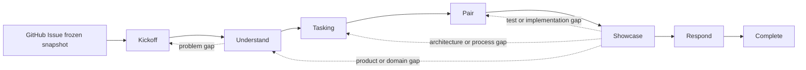

# Evidence Orchestrator 扩展维护指南

该目录保存当前仓库开发 Evidence 所用的确定性状态、执行、保护与审计代码。它是[内部研发工具](../../../engineering/evidence-orchestrator/product-boundary.md)，不是 Evidence 产品 runtime、bounded context 或用户能力；以 Evidence 的 Issue、模型、测试和代码验证工作流属于 dogfooding。

扩展只负责控制机制：

- Extension：状态、命令物化、路径保护、执行与审计；
- Agent：隔离角色、工具权限、Skill 触发和停止条件；
- Skill：Complicated / Complex 方法知识；
- Prompt：Clear、只读或固定格式任务；
- 人类 Navigator：Story、Scenario、Profile、模型/统一语言、Desk Check、Red、实际产品观察、Q3/Q4 评价、Showcase 与 Respond 决定。

活动 Working Knowledge 由 `engineering/evidence-orchestrator/working-knowledge-catalog.json` 编目。

## 知识循环



一轮是一个**交付迭代**，可以包含多张人工确认的 `US-xxx`，每张 Story 可以包含多个独立确认和实现的 `SC-xxx`。三个反馈粒度保持嵌套而不再压平：

- **Iteration**：GitHub Issue 快照与增量范围，起于迭代规划，止于一次集成 Showcase / Respond；
- **Story / Scenario**：Kickoff、Understand、建模、Tasking 与 Desk Check；同一 Story 可连续补充多个 Scenario，也可转向迭代中的下一张 Story；
- **TASK / TEST**：Pair 中单 checkpoint 的 Red、Green、Refactor。

具体流程：

1. **Kickoff**：AI 从冻结 Issue 提出一个候选 Story；人类确认、修订、拆分或延期。确认后分配下一个 `US-xxx`。完成一个验收切片后可回到 Kickoff 规划同一迭代的下一张 Story。
2. **Understand**：当前 WIP 始终只有一张 Story。一次提出一个面向业务的 TQA 问题；人类直接回答。AI 提出 Scenario 候选后由人类确认一个，再完成 Profile、模型展开、独立挑战和人工模型确认。一个 Scenario 完成 Pair 后可以回到当前 Story 的 TQA，继续确认下一项验收条件。
3. **Tasking**：针对当前确认 Scenario，根据 runtime、functional context 和技术边界唯一匹配 test-process v2，生成 Q2/Q1 test/task list；每个 TEST 只属于一个有序 TASK。人类 Desk Check 后锁定计划。
4. **Pair**：Navigator 每次只推进一个 TASK/TEST checkpoint。每个 TEST 分别产生 Red、Green、Refactor，全部完成后运行最终 quality gates。切片完成后人类必须选择 `continue-story`、`next-story` 或 `showcase`；前两者要求先创建人类所有的 Git checkpoint，使下一切片获得独立 baseline。
5. **Showcase**：只在关闭迭代范围后执行一次。重新执行本迭代所有已完成切片的 Q2，并要求每个 Scenario 都有实际产品行为和价值观察；Q3/Q4 风险决定和评价活动覆盖整个增量。只有人类 `accept` 才能进入 Respond。
6. **Respond**：总结整个交付增量，只提升被 Scenario、执行事实与集成 Showcase 共同验证的知识；人类确认后输出一个 next Probe 并完成本轮。

状态以 `completed_work_items` 保存已完成的 `US/SC` 验收切片，同时只允许一个 active Story、Scenario 和 Pair checkpoint。它不维护并行 Story WIP、独立审批队列或自动重试轮次。

## 目录结构

源码按知识行为所有者组织，不再按 requirements/evidence/testing 等技术阶段分桶：

```text
evidence-orchestrator/
├── index.ts                         # 仅导出 Pi host
├── iteration/                       # 跨循环聚合、状态、转换、反馈与工件布局
├── loops/
│   ├── kickoff/                     # 单 Story 候选与人工 Kickoff 决定
│   ├── understand/{tqa,scenario,modeling}/
│   ├── tasking/                     # test/task draft 与 Desk Check
│   ├── pair/                        # Navigator checkpoint 与 Driver session
│   ├── showcase/                    # Q2/Q3/Q4、Reviewer 与人工决定
│   └── respond/                     # knowledge response、人工确认与 next Probe
├── capabilities/
│   ├── issue-source/                # 冻结与验证 requirement source
│   ├── test-process/                # v2 catalog、匹配与命令物化
│   ├── execution-evidence/          # hash-chained observation 与 manifest
│   ├── worktree-protection/         # Git baseline、snapshot 与恢复
│   └── working-knowledge/           # catalog 与 promotion validation
├── adapters/
│   ├── pi/                          # 薄 host、命令、工具、状态与 activity host
│   ├── github/                      # GitHub CLI/Pi process adapter
│   └── node/                        # 隔离 activity 子进程
├── validation/                      # source boundary 与确定性验证入口
├── test-support/                    # 跨模块集成测试、fixtures 与 mocks
└── vitest.config.ts
```

### `iteration/`

- `state.ts` 与 `default-state.ts`：iteration envelope、loop 局部事实和唯一默认状态。
- `state-codec.ts` 与 `state-repository.ts`：严格编解码和持久化；状态不携带工作流版本标记。
- `transition-graph.ts`：合法 loop 转换及核心守卫。
- `feedback-routing.ts`：把语义缺口路由到知识活动，而不是技术阶段。
- `artifact-layout.ts` 与 `artifact-inventory.ts`：iteration ID、隔离工件路径、目录和只读清单。

### `loops/`

每个 Loop 拥有自己的候选、人工决定、局部状态推进和相邻规格测试。一个 Loop 不得导入另一个 Loop 的私有实现；确需交接时只消费确认状态、typed outcome，或显式 `public.ts` 契约。共享机制必须提升到 `capabilities/`，不得创建通用 `BaseLoop`。

### `capabilities/`

Capability 只承载两个以上 Loop 复用的稳定机制。Issue Source、Test Process、Execution Evidence、Worktree Protection 与 Working Knowledge 都以 iteration 类型为边界，不依赖 Pi UI 或某个 Loop 的私有实现。

### `adapters/`

- `pi/host.ts` 是生命周期组合根；根 `index.ts` 保持薄。
- `pi/commands.ts` 与 `pi/tools.ts` 只注册外部入口；参数解析、Schema 和 activity host 分文件维护。
- `pi/activity/` 负责任务构建、单 checkpoint 调度、执行、进度和渲染。
- `github/pi-cli.ts` 把 Pi 的可取消进程执行适配为 Issue Source port。
- `node/activity-agent-process.ts` 负责隔离 Pi 子进程，不向 Loop 暴露 `spawn`。

## 人工命令

```text
/evidence-new
/evidence-status
/evidence-issue-status
/evidence-issue-sync
/evidence-run [--dry-run] [当前活动补充指令]
/evidence-kickoff confirm [reason] | revise|split|defer|stop <reason>
/evidence-scenario confirm <DRAFT-xxx> [reason] | continue|split|defer <reason>
/evidence-modeling-profile confirm [reason] | set <subject> <method> <true|false> <reason>
/evidence-model confirm [reason] | revise|scenario-gap|method-gap <reason>
/evidence-desk-check approve|revise|architecture_gap|process_gap|scenario_gap <reason>
/evidence-pair [当前 Pair 人工决定参数]
/evidence-showcase [observe|risk|evaluate|accept|revise|reject 参数]
/evidence-respond approve|revise <reason>
```

命令按阶段显式暴露：

- `/evidence-run` 只运行当前状态允许的一个 activity、Driver 或确定性 command checkpoint，不接受人工决定；`--dry-run` 只预览任务。
- 其余阶段命令只记录该阶段的人工决定或观察；省略参数时打开交互选择器。
- `/evidence-pair` 在 Red、质量门禁失败或交付边界处记录 Navigator 决定。quality gates 全部通过后使用 `continue-story <reason>`、`next-story <reason>` 或 `showcase <reason>`。
- `/evidence-showcase` 记录产品观察、Q3/Q4 风险与评价，以及最终 accept/revise/reject 决定。

每条命令都会验证持久化状态；调用不属于当前阶段的命令会被对应守卫拒绝。单次命令不会连续运行整个 iteration。Agent 工具也按 loop/stage 动态启用；内置工具及其他扩展的工具保持不变。

## Agent 工具

活动工具只有以下类别：

- iteration：`start_from_issue`、`sync_issue`、`status`、`run_activity`；
- Kickoff / Understand：`propose_kickoff`、`ask_question`、`answer_question`、`propose_scenarios`、`propose_modeling_profile`、`record_model_analysis`、`record_model_challenge`；
- Tasking / Showcase / Respond：`propose_tasking`、`record_showcase_review`、`propose_response`。

完整名称都以 `evidence_orchestrator_` 开头。工具只能提出候选或记录可观测事实，不能执行人工决定。

## 执行证据

对于活动工作项 `US-xxx / SC-xxx`：

```text
artifacts/05-code/US-xxx/SC-xxx.execution.jsonl
artifacts/05-code/US-xxx/SC-xxx.manifest.json
artifacts/05-code/US-xxx/SC-xxx.summary.md
artifacts/06-review/US-xxx/SC-xxx.review-NNN.json
artifacts/06-review/showcase-risks.jsonl
artifacts/06-review/showcase-product-observations.jsonl
artifacts/06-review/showcase-evaluations.jsonl
artifacts/06-review/showcase-decisions.jsonl
artifacts/07-learning/knowledge-promotion.json
artifacts/07-learning/next-iteration.md
```

`execution.jsonl` 是唯一原始命令事实；manifest 和 summary 必须确定性生成，Agent 不得手填退出码、命令或 changed paths。

## 状态边界

持久化状态不携带工作流版本标记。没有活动 iteration 时不写入占位状态；新工作必须由人类以 `/evidence-new` 从明确的 GitHub Issue 创建。`artifacts/iterations/` 中已归档的目录仍是不可变研发证据，但运行时不会把其中的手写 JSON 解释为当前执行事实。

## 依赖方向

```text
index → adapters/pi
adapters → loops + capabilities + iteration
loops → capabilities + iteration
capabilities → iteration
validation → 各层公开 validator
```

额外约束由 `validation/source-boundaries.ts` 自动检查：

- `iteration/` 不依赖 Loop、Capability 或 Adapter；
- `capabilities/` 不依赖 Loop 或 Adapter；
- Loop 不能直接依赖另一个 Loop 的私有文件；
- 产品源码和 Loop 不依赖 Pi host；
- 生产模块必须可从 Extension 或验证入口到达；
- 已删除的 `runtime/`、`subagents/`、`workflow/`、`requirements/`、`evidence/`、`testing/`、`compatibility/` 不得重新出现。

`.pi/agents/` 不导入扩展代码，只通过注册工具交互。

## 维护规则

- 新状态字段先修改 `iteration/state.ts`，再修改 codec、repository 与相邻规格测试；磁盘 Schema 迁移必须是独立变更。
- 新转换或守卫放在 `iteration/transition-graph.ts`，语义反馈放在 `iteration/feedback-routing.ts`。
- Loop 行为留在所属 `loops/<loop>/`；只有跨 Loop 稳定复用的机制才进入 `capabilities/`。
- Pi/GitHub/Node 集成留在 `adapters/`；命令和工具不得复制业务守卫。
- Agent 不复制方法正文；方法变化更新 catalog 指向的 Skill/Prompt 及 eval。
- 测试命令必须来自人工批准且哈希锁定的 test-process 计划。
- 变更必须覆盖 full-loop happy path、主要反馈路由、source boundaries，以及 idle/native 状态边界。

## 验证

```sh
pnpm orchestrator:test
pnpm orchestrator:validate
pnpm exec eslint '.pi/extensions/evidence-orchestrator/**/*.ts' --no-warn-ignored
pnpm exec prettier --check '.pi/extensions/evidence-orchestrator/**/*.{ts,md}'
```
