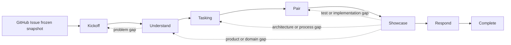

# Evidence Orchestrator 扩展维护指南

该目录保存当前仓库开发 Evidence 所用的确定性状态、执行、保护与审计代码。它是[内部研发工具](../../../engineering/evidence-orchestrator/product-boundary.md)，不是 Evidence 产品 runtime、bounded context 或用户能力；以 Evidence 的 Issue、模型、测试和代码验证工作流属于 dogfooding。

扩展只负责控制机制：

- Extension：状态、命令物化、路径保护、执行与审计；
- Agent：隔离角色、工具权限、Skill 触发和停止条件；
- Skill：Complicated / Complex 方法知识；
- Prompt：Clear、只读或固定格式任务；
- 人类 Navigator：Story、Scenario、Profile、Desk Check、Red、Showcase 与 Respond 决定。

活动 Working Knowledge 由 `engineering/evidence-orchestrator/working-knowledge-catalog.json` 编目。

## v5 知识循环



每轮只处理一张人工确认的 `US-xxx` 和一个人工确认的 `SC-xxx`：

1. **Kickoff**：AI 从冻结 Issue 提出一个候选 Story；人类确认、修订、拆分或延期。确认后才分配 `US-xxx`。
2. **Understand**：针对该 Story 一次提出一个非技术 TQA 问题；人类直接回答。AI 提出 Scenario 候选，人类确认一个。随后由人类确认建模 Profile，Builder 展开模型，独立只读 Challenger 检查 Scenario 与回归集。
3. **Tasking**：根据 runtime、functional context 和技术边界唯一匹配 test-process v2，生成自然语言 test/task list；人类 Desk Check 后锁定计划。
4. **Pair**：Navigator 每次只推进一个 checkpoint。短生命周期 Test Driver 与 Production Driver 受路径保护；锁定命令产生 Red、Green、Refactor 与最终 quality-gate 观测。
5. **Showcase**：重新执行已选 Q2，显式记录 Q3/Q4 风险，由独立只读 Reviewer 评审；只有人类 `accept` 才能进入 Respond。`revise` 按知识缺口回到 Kickoff、Understand、Tasking 或 Pair，`reject` 终止本轮。
6. **Respond**：只提升本轮实际使用且被 Scenario、执行事实与 Showcase 共同验证的知识；空 promotion 合法但必须有理由。人类确认后输出一个 next Probe 并完成本轮。

状态以 `loop` 和各 loop 的局部 stage/checkpoint 表示，不维护并行的线性流水线、批量 Story 队列、独立审批队列或重试轮次。

## 目录结构

```text
evidence-orchestrator/
├── index.ts                  # Pi 扩展组合根与状态栏生命周期
├── runtime/                  # 命令、模型工具、状态与活动执行 UI
├── subagents/                # 活动任务构建与隔离 pi 子进程
├── workflow/                 # v5 loop 状态、转换和 iteration 路径
├── requirements/             # Issue、Kickoff、单 Story TQA、Scenario
├── evidence/                 # 模型、挑战、Respond 与知识验证
├── testing/                  # 工序、Pair、执行 manifest 与 Showcase
├── validation/               # CI 确定性验证入口
├── tests/                    # 跨模块集成测试
└── vitest.config.ts
```

### `runtime/`

- `identity.ts`：扩展 ID、状态 key、状态前缀和消息类型。
- `commands.ts`：注册 `/evidence-*` 人工命令及交互式前置检查。
- `tools.ts`：注册供隔离 Agent 调用的 `evidence_orchestrator_*` 工具。
- `activity-dispatch.ts`：根据当前 loop/stage 解析一次活动、确定 Agent 或确定性动作。
- `activity-execution.ts`：统一命令和模型工具的活动执行、运行元数据与 Driver/Reviewer 保护。
- `activity-progress.ts`：可取消的前台活动进度；非 TUI 模式使用 status/widget。
- `activity-subagent-renderer.ts`：在 `details` 保留子进程事件，在 `content` 只返回最终回答。
- `status.ts`：显示 v5 状态；对终态旧版本仅显示不可变历史投影。

### `subagents/`

- `activity-runner.ts`：读取 `.pi/agents/*.md`，以 `--mode json` 启动隔离 Pi 子进程并转发 `message_end` / `tool_result_end`。
- `activity-task.ts`：只注入当前 Story/Scenario、必要路径、单次任务与停止边界；不复制 Skill 方法正文。

### `workflow/`

- `types.ts`：v5 loop、局部状态、人工决定、反馈与证据类型；另含终态旧版本只读投影类型。
- `default-state.ts`：新 v5 iteration 的唯一默认状态。
- `loop-catalog.ts`：合法 loop 转换与核心守卫。
- `state-store.ts`：严格读取/写入 v5 状态；拒绝已删除字段；终态旧版本只能经 `readStateSnapshot()` 查看，不能恢复、转换或写回。
- `iteration-paths.ts`：iteration ID 与隔离工件路径解析。

### `requirements/`

- `github-issue.ts`：冻结 Issue 快照、只读 Markdown 投影、漂移检查与 Kickoff 内显式同步。
- `kickoff.ts`：记录一个未授权候选并执行人工决定；只有确认才创建 `US-xxx` Card。
- `clarifications.ts`：活动 Story 的单问题 TQA 与回答历史，不支持 Story picker 或暂停切换。
- `scenarios.ts`：Scenario 候选与人工确认/继续/拆分/延期。
- `story-cards.ts`：单 Story Card 的文件格式与解析。

### `evidence/`

- `modeling.ts`：建模方法候选、人工 Profile 和候选模型操作。
- `model-projection.ts`：从候选模型确定性生成 Mermaid、glossary 和挑战上下文。
- `model-challenge.ts`：只读 Challenger 结论与语义反馈路由。
- `model-validation.ts`：Scenario/模型证据校验。
- `respond.ts`：知识提升候选、人工决定和 next Probe。
- `knowledge.ts`：统一产品、模型、架构和工序知识验证。
- `working-knowledge.ts`：验证 Skill/Prompt 的发现性、版本、负责人、认知行为、验证场景、反馈、替代关系和 eval。

### `testing/`

- `process-catalog.ts`：test-process Schema v2、目录读取与唯一匹配。
- `tasking.ts`：生成 test/task list、物化白名单命令、锁定计划并处理 Desk Check。
- `pairing.ts`：Navigator checkpoint、Driver 路径保护、Red 分类与 quality gates。
- `execution-recorder.ts`：执行锁定命令并追加 hash-chained `execution.jsonl`。
- `execution-manifest.ts`：从执行日志、批准计划和 Git 变化生成/重放 `manifest.json` 与 `summary.md`。
- `showcase.ts`：Q2 重跑、Q3/Q4 风险、只读 Reviewer 保护、人工决定和反馈路由。
- `worktree-snapshot.ts`：Driver/Reviewer 前后的确定性工作树比较与恢复。

## 人工命令

```text
/evidence-new
/evidence-status
/evidence-run [--dry-run]
/evidence-issue-status
/evidence-issue-sync
/evidence-kickoff confirm|revise|split|defer <reason>
/evidence-scenario confirm <DRAFT-xxx> <reason>
/evidence-scenario continue|split|defer <reason>
/evidence-modeling-profile confirm|revise <reason>
/evidence-desk-check approve|revise|scenario-gap|architecture-gap|process-gap <reason>
/evidence-pair accept-red|back-test|back-implementation|back-tasking|retry-quality <reason>
/evidence-showcase accept|revise|reject <reason>
/evidence-respond approve|revise <reason>
```

`/evidence-run` 只推进当前 loop 的一个活动或确定性 checkpoint。遇到人工决定时必须停止；它不会代替 Navigator 连续运行整个 iteration。

## Agent 工具

活动工具只有以下类别：

- iteration：`start_from_issue`、`sync_issue`、`status`、`run_activity`；
- Kickoff / Understand：`propose_kickoff`、`ask_question`、`answer_question`、`propose_scenarios`、`propose_modeling_profile`、`record_model_analysis`、`record_model_challenge`；
- Tasking / Showcase / Respond：`propose_tasking`、`record_showcase_review`、`propose_response`。

完整名称都以 `evidence_orchestrator_` 开头。工具只能提出候选或记录可观测事实，不能执行人工决定。

## 执行证据

对于活动工作项 `US-xxx / SC-xxx`：

```text
artifacts/05-code/US-xxx/SC-xxx.execution.jsonl
artifacts/05-code/US-xxx/SC-xxx.manifest.json
artifacts/05-code/US-xxx/SC-xxx.summary.md
artifacts/06-review/US-xxx/SC-xxx.review-NNN.json
artifacts/06-review/showcase-risks.jsonl
artifacts/06-review/showcase-decisions.jsonl
artifacts/07-learning/knowledge-promotion.json
artifacts/07-learning/next-iteration.md
```

`execution.jsonl` 是唯一原始命令事实；manifest 和 summary 必须确定性生成，Agent 不得手填退出码、命令或 changed paths。

## 旧 iteration 边界

`artifacts/iterations/ITER-0000` 与 `ITER-0001` 等历史目录保持原字节不变。终态旧版本 `evidence-state.json` 仅可通过状态命令读取：

- 不迁移或重写旧状态；
- 不把旧手写执行 JSON 当作 v5 执行事实；
- 不恢复仍处于活动状态的旧 iteration；
- 新工作必须由人类以 `/evidence-new` 创建独立 v5 iteration。

## 依赖方向

```text
index/runtime
  → subagents
  → workflow
  → requirements/evidence/testing

validation
  → workflow/requirements/evidence/testing
```

底层模块不得反向依赖 `runtime/`。`.pi/agents/` 不导入扩展代码，只通过注册工具交互。

## 维护规则

- 新状态字段先修改 `workflow/types.ts`，再修改 `workflow/state-store.ts` 与相邻规格测试。
- 新转换或守卫放在 `workflow/loop-catalog.ts`，不要散落到命令或 Agent。
- Agent 不复制方法正文；方法变化更新 catalog 指向的 Skill/Prompt 及 eval。
- 测试命令必须来自人工批准且哈希锁定的 test-process 计划。
- 变更必须覆盖 full-loop happy path、主要反馈路由和旧版本只读边界。

## 验证

```sh
pnpm orchestrator:test
pnpm orchestrator:validate
pnpm exec eslint '.pi/extensions/evidence-orchestrator/**/*.ts' --no-warn-ignored
pnpm exec prettier --check '.pi/extensions/evidence-orchestrator/**/*.{ts,md}'
```
