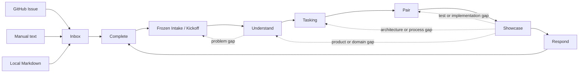

# Evidence Orchestrator 扩展维护指南

该目录保存当前仓库开发 Evidence 所用的确定性状态、执行、保护与审计代码。它是[内部研发工具](../../../engineering/evidence-orchestrator/product-boundary.md)，不是 Evidence 产品 runtime、bounded context 或用户能力；以 Evidence 的 Inbox 来源、模型、测试和代码验证工作流属于 dogfooding。

扩展只负责控制机制：

- Extension：状态、命令物化、路径保护、执行与审计；
- Agent：隔离角色、工具权限、Skill 触发和停止条件；
- Skill：Complicated / Complex 方法知识；
- Prompt：Clear、只读或固定格式任务；
- 人类权威：Story、Scenario、Profile、模型/统一语言、Desk Check、完整 Story 编码批准、实际产品观察、Q3/Q4 评价、Showcase 与 Respond 决定；Pair 内部 Red 由独立 AI Reviewer 分类。

活动 Working Knowledge 由 `engineering/evidence-orchestrator/working-knowledge-catalog.json` 编目。

## 知识循环



Inbox 位于 iteration 之外，可同时保存多个来源 revision 和未经确认的 Story 候选。GitHub Issue 只是一个 Source Adapter；AI 候选没有权威性。人类以 `/evidence-new CAND-xxxx` 明确认领一张 ready 候选；系统为它分配 `ITER-xxxx`、创建 `evidence/iter-xxxx` 分支和 `.worktrees/evidence/ITER-xxxx` worktree，再冻结自包含 Intake。只有 Kickoff 人工确认后生成的 `US-xxx` Story Card 才是该 Work Item 的交付权威。

一轮是一个以**单一人工确认 User Story** 为边界的交付迭代。三个反馈粒度保持嵌套：

- **Iteration / Story**：一轮恰好交付一张 `US-xxx`，起于 Kickoff，止于该 Story 的 Showcase / Respond；
- **Scenario Set**：TQA 后一次确认该 Story 范围内完整的 `SC-xxx` 验收集合，联合建模、Tasking 和验收；
- **TASK / TEST**：Pair 中逐 TEST 的 Red/Green；Refactor 按 process step 汇总一次。

具体流程：

1. **Inbox / Kickoff**：Inbox Analyst 从一至五个精确来源 revision 提取一至五张候选；人类选择一张并冻结 Intake。Kickoff 人工确认、修订、拆分或延期，确认后分配本迭代唯一的 `US-xxx`。
2. **Understand**：每张活动 Story 使用一条持久 TQA 会话，一次提出一个面向业务的问题；人类直接回答后，下一次 requirements-analyst checkpoint 恢复同一 Pi session。AI 列出完整 Scenario Set 后由人类整体确认，再确认建模 Profile：`none/false` 确定性记录无模型影响并直接进入 Tasking；其他方法逐场景联合展开，`model_change_required=false` 保持空 operations，只有 `true` 提出模型候选，之后均经独立挑战和人工模型确认。其他活动角色仍使用隔离的临时会话。
3. **Tasking**：一次消费全部确认 Scenario，根据 runtime、functional context 和技术边界唯一匹配 test-process v3，解析真实 Nx project ownership/targets，并生成逐 TEST 聚焦命令、项目门禁及去重的 Q2/Q1 test/task list；每个 Then 有 Q2 追踪，每个 TEST 只属于一个有序 TASK。人类 Desk Check 后锁定 Story 计划。
4. **Pair**：一次 `/evidence-run ITER-xxxx` 由控制器自动推进指定 Story 的完整编码：短生命周期 Test/Production Driver 逐 TEST 编辑，控制器执行并记录 Red/Green，独立 AI Reviewer 分类 Red；同一 process step 全部 Green 后只进行一次有界 Refactor，随后运行全部 quality gates。Desk Check 把人工预算策略 hash、结构性调用量、timeout、retry、checkpoint 与可用 Q/T/C hard limit 锁进计划；Pair 只读该 Envelope。相同 failure fingerprint、无进展、activity/command timeout、soft/hard budget 或观测缺口会生成类型化异常并停止，不能由 Agent 提高额度；全绿后可用 `/evidence-explain-diff ITER-xxxx` 生成一份仓库外、自包含且非权威的 HTML 理解材料，之后仍由人类一次批准完整 Story 编码才进入 Showcase。
5. **Showcase**：重新执行本 Story 的全部 Q2，并要求每个 Scenario 都有实际产品行为和价值观察；Q3/Q4 风险决定和评价活动覆盖整个 Story 增量。只有人类 `accept` 才能进入 Respond。
6. **Respond**：总结整个 Story 增量，只提升被 Scenario Set、执行事实与 Showcase 共同验证的知识；人类确认后输出一个 next Probe 并完成本轮。

仓库级 Board 允许最多三张 active Story 受限并行流动；每张卡仍只有一个 worktree-local `WorkflowState`、一张人工确认 Story、一个完整 Scenario Set 和一个 Pair checkpoint。Board 管理 `discovery / planning / ready / delivery / review / done` admission，Blocked 仍占 WIP；Delivery 和全局 Pair runner 初始上限均为一。WIP 满时只记录 `pending_lane`，必须由人类显式 Pull，不自动选择下一张 Story。每张 Story 以 activity lease 串行化，Pair 另持有全局 runner lease；过期 lease 只能带理由显式恢复。

## 目录结构

源码按知识行为所有者组织，不再按 requirements/evidence/testing 等技术阶段分桶：

```text
evidence-orchestrator/
├── index.ts                         # 仅导出 Pi host
├── iteration/                       # Board 聚合、单 Story 状态、转换、反馈与工件布局
├── loops/
│   ├── kickoff/                     # 单 Story 候选与人工 Kickoff 决定
│   ├── understand/{tqa,scenario,modeling}/
│   ├── tasking/                     # test/task draft 与 Desk Check
│   ├── pair/                        # 自动 Pair checkpoint、编码批准、Driver 与 Red Reviewer session
│   ├── showcase/                    # Q2/Q3/Q4、Reviewer 与人工决定
│   └── respond/                     # knowledge response、人工确认与 next Probe
├── capabilities/
│   ├── inbox/                       # 来源 revision、Story 候选与冻结 Intake
│   ├── flow-control/                # lane/WIP admission、State CAS 与 bounded lease
│   ├── work-item-worktree/          # Story worktree provision/archive
│   ├── modeling-evidence/           # 跨 Understand、Tasking 与 Pair 的模型证据
│   ├── test-process/                # v3 catalog、Nx ownership、逐 TEST 命令与门禁物化
│   ├── activity-observability/      # 非权威 activity trace、usage 与聚合
│   ├── execution-evidence/          # hash-chained observation 与 manifest
│   ├── worktree-protection/         # Git baseline、snapshot 与恢复
│   └── working-knowledge/           # catalog 与 promotion validation
├── adapters/
│   ├── pi/                          # 薄 host、命令、工具、状态与 activity host
│   ├── github/                      # GitHub CLI/Pi process adapter
│   ├── local/                       # 文本与本地 Markdown Inbox source adapter
│   └── node/                        # 隔离 activity agent 子进程
├── validation/                      # source boundary 与确定性验证入口
├── test-support/                    # 跨模块集成测试、fixtures 与 mocks
└── vitest.config.ts
```

### `iteration/`

- `board-state.ts`、`board-codec.ts` 与 `board-repository.ts`：Git common dir 下的仓库级调度权威、严格编解码、原子写入和短锁。
- `state.ts` 与 `default-state.ts`：一张 worktree-local Story 的 iteration envelope 与 loop 局部事实。
- `state-codec.ts` 与 `state-repository.ts`：严格编解码和 `.evidence-iteration-state.json` 持久化；状态不携带 Board 或工作流版本标记。
- `transition-graph.ts`：合法 loop 转换及核心守卫。
- `feedback-routing.ts`：把语义缺口路由到知识活动，而不是技术阶段。
- `artifact-layout.ts` 与 `artifact-inventory.ts`：iteration ID、隔离工件路径、目录和只读清单。

### `loops/`

每个 Loop 拥有自己的候选、人工决定、局部状态推进和相邻规格测试。一个 Loop 不得导入另一个 Loop 的私有实现；确需交接时只消费确认状态、typed outcome，或显式 `public.ts` 契约。共享机制必须提升到 `capabilities/`，不得创建通用 `BaseLoop`。

### `capabilities/`

Capability 只承载两个以上 Loop 复用的稳定机制。Inbox、Modeling Evidence、Test Process、Execution Evidence、Worktree Protection 与 Working Knowledge 不依赖 Pi UI 或某个 Loop 的私有实现。Inbox 的 source revision 与 candidate 跨 iteration 存续，而冻结 Intake 进入单一 iteration 边界。完整 Story 编码批准属于 Pair Loop，只能由 Pi 人工命令采集；Showcase 不提供隐式批准入口。

### `adapters/`

- `pi/host.ts` 是生命周期组合根；根 `index.ts` 保持薄。
- `pi/commands.ts` 与 `pi/tools.ts` 只注册外部入口；参数解析、Schema 和 activity host 分文件维护。
- `pi/activity/` 负责任务构建、调度、执行、进度和 activity agent 渲染；非 Pair 活动保持单 checkpoint，Pair 在一次运行中循环短生命周期 checkpoint 直到全绿或异常。
- `github/inbox-source.ts` 与 `github/pi-cli.ts` 把 GitHub Issue 适配为 provider-neutral Inbox capture。
- `local/inbox-sources.ts` 把人工文本与仓库内 Markdown 适配为同一种 Inbox source revision。
- `node/activity-agent-process.ts` 负责隔离 Pi activity agent 子进程，不向 Loop 暴露 `spawn`；普通 checkpoint 使用临时 session，活动 Story 的 TQA checkpoint 以稳定 session id 恢复同一多轮会话。

## 人工命令

```text
/evidence-inbox [list | add github|text|file | sync INBOX-xxxx | extract INBOX-xxxx,... | defer|reject CAND-xxxx <reason>]
/evidence-new CAND-xxxx
/evidence-flow list | pull ITER-xxxx | recover ITER-xxxx <reason> | archive ITER-xxxx <reason>
/evidence-status [ITER-xxxx [artifacts [cursor]]]
/evidence-answer ITER-xxxx Q-xxx <answer>
/evidence-run ITER-xxxx [--dry-run] [当前活动补充指令]
/evidence-kickoff ITER-xxxx confirm [reason] | revise|split|defer|stop <reason>
/evidence-scenario ITER-xxxx confirm <DRAFT-xxx,...> [reason] | continue|split|defer <reason>
/evidence-modeling-profile ITER-xxxx confirm [reason] | set <subject> <method> <true|false> <reason>
/evidence-model ITER-xxxx confirm [reason] | revise|scenario-gap|method-gap <reason>
/evidence-desk-check ITER-xxxx approve [reason] | revise|architecture_gap|process_gap|scenario_gap <reason>
/evidence-pair ITER-xxxx approve <reason> | back-test|back-implementation|back-tasking|retry-quality <reason>
/evidence-explain-diff ITER-xxxx
/evidence-showcase ITER-xxxx [observe|risk|evaluate|accept|revise|reject 参数]
/evidence-respond ITER-xxxx approve|revise <reason>
```

命令按阶段显式暴露：

- 无参数运行 `/evidence-inbox` 时，空 Inbox 会先让人选择来源；来源 revision 保存成功后自动打开 extract 来源选取界面，取消选取则只保留来源。已有来源时显示 Inbox 状态，显式 `list` 始终只读。
- `/evidence-new` 必须携带由人类明确选择的 `CAND-xxxx`；没有 Candidate picker，也不会隐式 Pull 其他 Story。
- `/evidence-flow` 是无 UI Board 控制面：`list` 只读，`pull` 只接纳指定 pending lane，`recover` 只处理 failed provisioning 或过期 lease，`archive` 只移除干净的 terminal worktree；后三者都要求精确 Iteration，恢复和归档要求理由。
- `/evidence-status` 无 Iteration 时返回小于 4 KiB 的 Board summary；`/evidence-status ITER-xxxx` 返回一张 Story 的 loop/stage/budget，`artifacts` 最多分页 50 项。cursor 绑定 Board revision、Iteration 和 inventory hash。任何视图都不扫描或列出 `apps/`、`libs/`，也不提供 `files`。
- `/evidence-run ITER-xxxx` 对非 Pair loop 只运行该 Story 当前允许的一个 activity checkpoint；Ready→Delivery 先做 WIP admission，Pair 中自动串行执行完整编码 Story，直到全绿待批或异常停止。它不接受人工决定；`--dry-run` 只预览任务。
- 每次 Agent dispatch 的 task 以最大 16 KiB 的确定性 Context Capsule 开头，只包含当前 Identity、Decision、人工 Authority、精确输入路径、工作单元、工具/路径边界与停止条件；长工件由 Agent 按路径读取。TQA Capsule 始终给出精确 clarification-history 路径，持久 session 不是事实源。
- 其余阶段命令都以 `ITER-xxxx` 为首参数，只记录该 worktree 当前阶段的人工决定或观察；只省略决定参数时可打开交互审查界面。`/evidence-desk-check ITER-xxxx` 在一个有界 Decision Packet 中投影 authority scope/exclusions、Scenario、模型、TEST/TASK、process/project、commands/gates、budget、readiness checks 和精确 evidence refs。
- Decision Packet 是临时、只读、非权威投影：打开、滚动、取消或理由取消均不落盘；提交前会重算 subject hash，发生候选、模型、process/project、policy、Git 或状态漂移时拒绝记录。真正批准仍由 `decideTasking()` 重跑全部守卫并写入既有 decision/plan/Pair 工件。
- `/evidence-desk-check ITER-xxxx <显式决定>` 不打开 Packet；不支持 custom TUI 的交互宿主保留既有 select/input 降级路径。Packet 不增加 Agent 或模型调用。
- `/evidence-pair ITER-xxxx approve <reason>` 在全部 quality gates 通过后写入 `coding-decision.json`，作为完整 Story 编码的人类权威并进入 Showcase；其他参数仅用于自动化异常的显式回退。
- `/evidence-explain-diff ITER-xxxx` 仅在 `quality_gates_passed` 后启动带 activity lease 的短生命周期 Change Explainer：只读分析稳定 diff、Scenario、模型、计划和 manifest，并把完整 HTML 返回控制器；控制器恢复任何仓库越界写入、验证结构后向系统临时目录（可用 `EVIDENCE_EXPLANATION_DIR` 指定其他仓库外目录）写入一份日期前缀的自包含 HTML，并在 iteration 内记录路径与哈希。该材料可选且不构成测试事实、审查结论或批准。
- `/evidence-showcase ITER-xxxx` 记录指定 Story 的产品观察、Q3/Q4 风险与评价，以及最终 accept/revise/reject 决定。

每条 Story 命令都会把 Iteration 精确解析到 canonical worktree，并验证 Board lifecycle、pending admission 和 worktree-local State；调用不属于当前阶段的命令会被对应守卫拒绝。Parent Navigator 只保留 Inbox、start、Board/status、run 与 answer 调度工具；Activity child 只保留其环境绑定 Iteration 和 loop/stage 允许的 mutation tool，并验证 Iteration、Board root、lease id 与 State hash CAS。内置工具及其他扩展的工具保持不变。

## Agent 工具

活动工具只有以下类别：

- Inbox / iteration：`propose_inbox_stories`、`start_from_candidate`、`status`、`run_activity`；
- Kickoff / Understand：`propose_kickoff`、`ask_question`、`answer_question`、`propose_scenarios`、`propose_modeling_profile`、`record_model_analysis`、`record_model_challenge`；
- Tasking / Showcase / Respond：`propose_tasking`、`record_showcase_review`、`propose_response`。

完整名称都以 `evidence_orchestrator_` 开头。工具只能提出候选或记录可观测事实，不能执行人工决定。宽泛 `status` 只保留给父 Navigator；短生命周期 Activity Agent 不拥有它，事实不足时必须补充 Capsule 或窄 checkpoint 输入。child invocation 关闭无关 prompt-template 自动发现，但继续加载项目 `AGENTS.md` 安全与架构 Context。

## 执行证据

每轮先保存独立的非权威运行 trace；对于活动 Story `US-xxx`，命令执行事实仍单独保存（manifest 内保留逐 Scenario 追踪）：

```text
artifacts/iterations/ITER-xxxx/activity-trace.jsonl  # Agent/Controller usage、耗时、停止原因与关联；非验收权威
artifacts/05-code/US-xxx/execution.jsonl
artifacts/05-code/US-xxx/automation-exceptions/EXC-xxx.json
artifacts/05-code/US-xxx/manifest.json
artifacts/05-code/US-xxx/summary.md
artifacts/05-code/US-xxx/change-explanation.json  # 可选；HTML 本体位于仓库外
artifacts/06-review/US-xxx/review-NNN.json
artifacts/06-review/showcase-risks.jsonl
artifacts/06-review/showcase-product-observations.jsonl
artifacts/06-review/showcase-evaluations.jsonl
artifacts/06-review/showcase-decisions.jsonl
artifacts/07-learning/knowledge-promotion.json
artifacts/07-learning/next-iteration.md
```

`activity-trace.jsonl` 使用 sequence 与 SHA-256 chain，只保存 task/output/error 哈希和有界 telemetry，不保存原始 Prompt、完整模型输出、stderr 或 child transcript；started 没有对应 finished 时会显式成为 incomplete span。Pair automation 使用父 span，Driver、Red Reviewer 和确定性 Controller checkpoint 使用子 span，命令子 span只引用对应 `execution.jsonl` sequence。

普通 command activity 成功、Pair 全绿与 HTML explanation 完成后使用 Pi custom entry：它们可在 TUI 折叠/展开并持久化，但不参与父 LLM Context。只有待回答 TQA 问题和需要人工异常路由的失败使用最大 2 KiB custom message；activity tool 的模型可见 content 同样最大 2 KiB，完整 child events 只保留在本地 tool details/TUI。

`execution.jsonl` 仍是唯一原始命令事实，并区分正常 exit、timeout、spawn error 与 signal termination；manifest 和 summary 必须确定性生成，Agent 不得手填退出码、命令或 changed paths。`automation-exceptions/` 保存停止 kind、policy/envelope hash、trace usage、触发 span/sequence/fingerprint 与允许的人工路由。Activity trace 不改变活动通过/失败，也不能替代测试或人工决定。Change Explainer HTML 是非确定性的理解材料，不能替代或修改这些执行证据。

## 状态边界

仓库级 Board 位于 Git common dir 的 `evidence-orchestrator/board.json`；每个 Story worktree 只保存 `.evidence-iteration-state.json`，且不携带工作流版本或其他 Story。Primary checkout 不保存占位 Story State；Inbox 独立持久化于 `artifacts/inbox/`。新工作必须由人类以 `/evidence-new CAND-xxxx` 从 ready 候选创建。Board/lease 是本地调度事实，不替代 worktree 内的 Intake、人工决定和执行证据；归档 worktree 删除后保留分支和不可变 iteration artifacts。

## 依赖方向

```text
index → adapters/pi
adapters → loops + capabilities + iteration
loops → capabilities + iteration
capabilities → iteration
validation → 各层公开 validator
```

额外约束由 `validation/source-boundaries.ts` 自动检查：

- `iteration/` 不依赖 Loop、Capability 或 Adapter；
- `capabilities/` 不依赖 Loop 或 Adapter；
- Loop 不能直接依赖另一个 Loop 的私有文件；
- 产品源码和 Loop 不依赖 Pi host；
- 生产模块必须可从 Extension 或验证入口到达；
- 已删除的 `runtime/`、`subagents/`、`workflow/`、`requirements/`、`evidence/`、`testing/`、`compatibility/` 不得重新出现。

`.pi/agents/` 不导入扩展代码，只通过注册工具交互。

## 维护规则

- 新状态字段先修改 `iteration/state.ts`，再修改 codec、repository 与相邻规格测试；磁盘 Schema 迁移必须是独立变更。
- 新转换或守卫放在 `iteration/transition-graph.ts`，语义反馈放在 `iteration/feedback-routing.ts`。
- Loop 行为留在所属 `loops/<loop>/`；只有跨 Loop 稳定复用的机制才进入 `capabilities/`。
- Pi/GitHub/Node 集成留在 `adapters/`；命令和工具不得复制业务守卫。
- Agent 不复制方法正文；方法变化更新 catalog 指向的 Skill/Prompt 及 eval。
- 测试命令必须来自人工批准且哈希锁定的 v3 test-process 计划；TypeScript 路径必须匹配锁定 Nx owner，最终门禁只读取 Desk Check 已物化命令。
- `engineering/evidence-orchestrator/execution-budget.json` 由人类与 Git 管理；Agent 只能读取。`null` 是 shadow-only，不是无限额度；提高 active Pair 预算必须返回 Tasking 并重新 Desk Check。
- 变更必须覆盖 full-loop happy path、主要反馈路由、source boundaries，以及 idle/native 状态边界。

## 验证

```sh
pnpm orchestrator:typecheck
pnpm orchestrator:test
pnpm orchestrator:validate
pnpm exec eslint '.pi/extensions/evidence-orchestrator/**/*.ts' --no-warn-ignored
pnpm exec prettier --check '.pi/extensions/evidence-orchestrator/**/*.{ts,md}'
```
