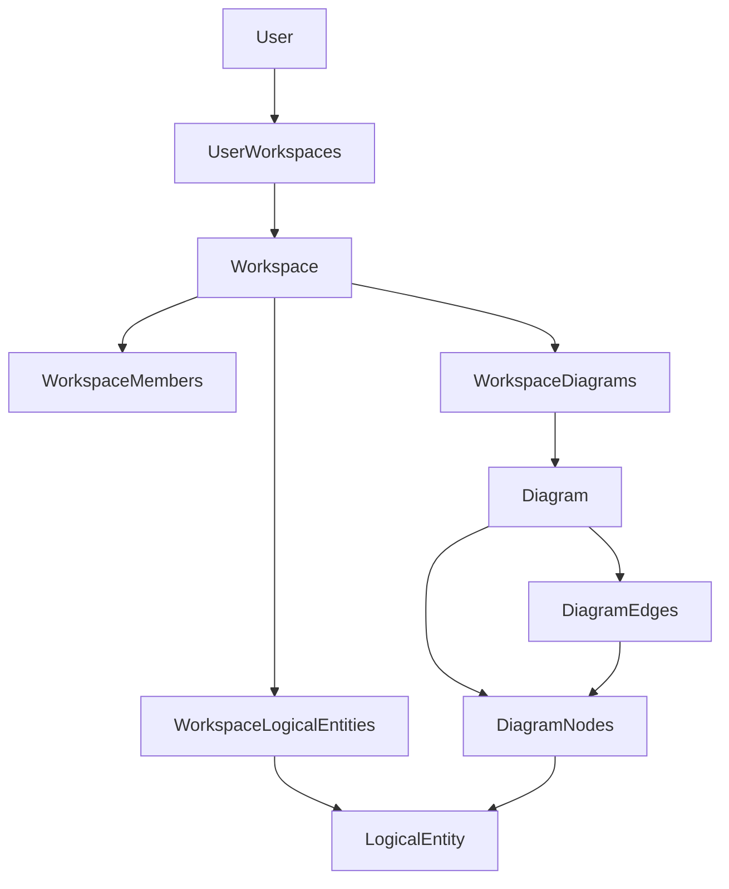

# 聚合

本文定义 Evidence 的聚合边界、聚合根、子集合和一致性规则，用于指导后续架构设计与代码实现。

## 聚合总览

| 聚合                    | 聚合根        | 子对象/集合                                                   | 主要一致性边界                     |
| ----------------------- | ------------- | ------------------------------------------------------------- | ---------------------------------- |
| User Aggregate          | User          | UserWorkspaces                                                | 用户能访问哪些工作区。             |
| Workspace Aggregate     | Workspace     | WorkspaceMembers、WorkspaceDiagrams、WorkspaceLogicalEntities | 工作区内成员、图和逻辑实体的归属。 |
| Diagram Aggregate       | Diagram       | DiagramNodes、DiagramEdges                                    | 图内节点与边的一致性。             |
| LogicalEntity Aggregate | LogicalEntity | attributes、behaviors、tags                                   | 单个业务概念定义的一致性。         |

## User Aggregate

### 聚合根

User

### 子集合

- UserWorkspaces

### 职责

- 提供用户资源入口。
- 列出用户可访问的工作区。
- 支持创建工作区，并建立 owner 成员关系。

### 不变量

- 用户身份必须存在才能访问其工作区集合。
- 默认用户应能访问默认工作区。
- 创建工作区后，创建用户必须成为工作区 owner。

### 典型命令

| 命令                   | 结果                                  |
| ---------------------- | ------------------------------------- |
| CreateWorkspace        | 新建 Workspace，并创建 owner Member。 |
| ListUserWorkspaces     | 返回用户可访问的工作区集合。          |
| GetWorkspaceByIdentity | 返回指定工作区或 NotFound。           |

## Workspace Aggregate

### 聚合根

Workspace

### 子集合

- WorkspaceMembers
- WorkspaceDiagrams
- WorkspaceLogicalEntities

### 职责

- 作为建模协作容器。
- 管理成员关系。
- 管理工作区下的图。
- 管理工作区下的逻辑实体。

### 不变量

- 工作区内成员不能重复。
- 图必须归属于当前工作区。
- 逻辑实体必须归属于当前工作区。
- 删除工作区时，相关成员、图、逻辑实体必须遵守软删除或一致性清理策略。

### 典型命令

| 命令                         | 结果                              |
| ---------------------------- | --------------------------------- |
| AddMember                    | 添加成员；重复成员返回 Conflict。 |
| RemoveMember                 | 移除成员关系。                    |
| CreateDiagram                | 在工作区下创建图。                |
| CreateLogicalEntity          | 在工作区下创建逻辑实体。          |
| ListWorkspaceLogicalEntities | 分页返回逻辑实体。                |

## Diagram Aggregate

### 聚合根

Diagram

### 子集合

- DiagramNodes
- DiagramEdges

### 职责

- 维护图内节点和边。
- 确保边连接合法节点。
- 支持图详情读取时嵌入节点和边。

### 不变量

- 节点必须属于当前 Diagram。
- 边的 source 和 target 必须属于当前 Diagram。
- 边不能引用已删除或不存在的节点。
- 节点引用 LogicalEntity 时，LogicalEntity 应属于同一 Workspace。

### 典型命令

| 命令       | 结果                         |
| ---------- | ---------------------------- |
| AddNode    | 创建图节点，可引用逻辑实体。 |
| UpdateNode | 更新节点位置、样式或引用。   |
| RemoveNode | 删除节点，并处理相关边。     |
| AddEdge    | 创建连接两个节点的边。       |
| UpdateEdge | 更新关系类型或标签。         |
| RemoveEdge | 删除图边。                   |

## LogicalEntity Aggregate

### 聚合根

LogicalEntity

### 内部组成

- Attribute[]
- Behavior[]
- Tag[]
- Type/SubType
- Definition

### 职责

- 表达业务概念定义。
- 维护类型、子类型、属性、行为、标签的一致性。
- 为图节点提供可引用的业务语义。

### 不变量

- type 必须有效。
- sub_type 必须与 type 匹配。
- definition 应可读且能解释该业务概念。
- attributes、behaviors、tags 不应破坏实体类型语义。

### 典型命令

| 命令                  | 结果                         |
| --------------------- | ---------------------------- |
| CreateLogicalEntity   | 创建业务概念。               |
| UpdateLogicalEntity   | 更新定义、属性、行为和标签。 |
| DeleteLogicalEntity   | 软删除逻辑实体。             |
| ClassifyLogicalEntity | 修改或确认类型/子类型。      |

## 聚合关系

## 一致性策略

| 场景                          | 一致性要求          | 建议处理                                                   |
| ----------------------------- | ------------------- | ---------------------------------------------------------- |
| 创建工作区                    | 同步创建 owner 成员 | 放在 UserWorkspaces/WorkspaceMembers 的领域操作中。        |
| 添加重复成员                  | 不允许重复          | 返回 Conflict。                                            |
| 创建节点引用不存在逻辑实体    | 不允许无效引用      | 返回 Validation 或 NotFound。                              |
| 删除节点后存在相关边          | 不允许悬空边        | 删除节点时同步删除或阻止删除并提示。                       |
| 删除逻辑实体后节点仍引用      | 需明确策略          | 推荐保留节点但标记引用失效，或阻止删除；后续架构阶段确定。 |
| fake store 与 PostgreSQL 行为 | 必须一致            | 通过 contract tests 固化。                                 |

## 事务边界建议

- 创建工作区 + owner 成员：同一事务。
- 添加图节点：校验 Diagram 和 LogicalEntity 引用后写入。
- 添加图边：校验 source/target 后写入。
- 删除节点及相关边：同一事务。
- 逻辑实体更新：单聚合事务。

## 设计取舍

- Workspace 是大聚合入口，但不应在单次操作中加载所有 Diagram 和 LogicalEntity。
- Diagram 是图结构一致性的核心边界，尤其负责防止悬空边。
- LogicalEntity 保持独立，便于多个图复用同一业务概念。
- API handler 不应直接实现聚合不变量，应委托 domain/persistent 层。
