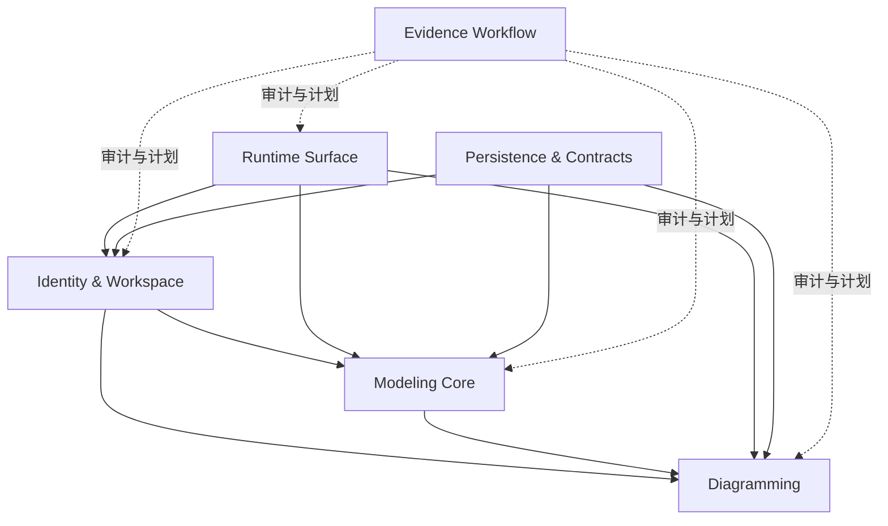

# 限界上下文

本文根据当前 Evidence 项目的业务目标、代码结构和需求阶段故事地图，划分核心限界上下文，并明确上下文职责、边界和上下文之间的关系。

## 上下文总览

| 上下文                  | 类型          | 职责                                                      | 当前代码落点                                                                                  |
| ----------------------- | ------------- | --------------------------------------------------------- | --------------------------------------------------------------------------------------------- |
| Identity & Workspace    | 支撑子域      | 用户、工作区、成员关系与访问入口。                        | `domain/user.rs`、`domain/workspace.rs`、`domain/member.rs`、`api/users.rs`、workspace routes |
| Modeling Core           | 核心子域      | 逻辑实体定义、领域概念分类、属性/行为/标签。              | `domain/logical_entity.rs`、logical entity API、persistent logical entities                   |
| Diagramming             | 核心子域      | 图、节点、边及其与逻辑实体的可视化关系。                  | `domain/diagram/`、diagram/node/edge API、persistent diagram entities                         |
| Runtime Surface         | 支撑子域      | Web 与 Desktop 的共享前端运行体验。                       | `apps/web/`、`apps/desktop/`、Tauri config                                                    |
| Persistence & Contracts | 通用/支撑子域 | SeaORM/PostgreSQL、fake store、契约测试和 schema 初始化。 | `persistent/`、`persistent/entities/`、`persistent/test_support.rs`、`persistent/store.rs`    |
| Evidence Workflow       | 支撑子域      | 需求、领域模型、架构、计划、编码、评审的审计流。          | `.pi/extensions/evidence-workflow/`、`.pi/skills/`、`artifacts/`                              |

## Identity & Workspace Context

### 目的

提供 Evidence 的入口和协作边界。用户通过工作区组织模型，成员关系决定谁属于某个工作区以及承担什么角色。

### 领域对象

- User
- Workspace
- Member
- UserWorkspaces
- WorkspaceMembers

### 边界内规则

- 默认用户 `desktop-user` 应能访问默认工作区 `default-workspace`。
- 创建工作区时，创建者自动成为 owner。
- 同一用户不能作为重复成员加入同一工作区。
- 工作区是 Diagram 和 LogicalEntity 的父级边界。

### 不负责

- 不负责图节点布局。
- 不负责逻辑实体的业务类型分类。
- 不负责前端渲染细节。

## Modeling Core Context

### 目的

承载 Evidence 的核心业务语言：Evidence、Participant、Role、Context 等逻辑实体，以及它们的定义、属性、行为和标签。

### 领域对象

- LogicalEntity
- LogicalEntityType
- LogicalEntitySubType
- Attribute
- Behavior
- Tag

### 边界内规则

- 逻辑实体必须属于某个工作区。
- 逻辑实体类型只能来自受控枚举：Evidence、Participant、Role、Context。
- 子类型必须与主类型兼容。
- 逻辑实体可以被图节点引用，但不依赖图节点存在。

### 不负责

- 不负责图上的位置、样式和边连接。
- 不直接处理 Web/Desktop 运行模式。
- 不直接暴露数据库表结构给 API 使用者。

## Diagramming Context

### 目的

将逻辑实体以图的方式表达出来，帮助团队理解证据、参与者、角色和上下文之间的关系。

### 领域对象

- Diagram
- DiagramNode
- DiagramEdge
- DiagramNodes
- DiagramEdges

### 边界内规则

- 图必须属于某个工作区。
- 节点必须属于某个图。
- 边必须连接同一图中的 source/target 节点。
- 节点可以引用逻辑实体；引用不存在时应返回明确错误。
- 图详情读取时可以内嵌节点和边，支撑前端一次性渲染。

### 不负责

- 不定义逻辑实体的类型体系。
- 不管理工作区成员角色。
- 不决定具体前端图渲染库。

## Runtime Surface Context

### 目的

确保 Evidence 的 Web 与 Desktop 是同一产品的不同运行界面，而不是分裂产品。

### 边界内规则

- `apps/web` 是唯一前端源码。
- Desktop dev 通过 Tauri 启动 Vite dev server。
- Desktop build 使用 `apps/web/dist`。
- Web 和 Desktop 使用同一 REST API 语义。

### 不负责

- 不定义核心领域规则。
- 不复制后端 API。
- 不引入第二套桌面前端业务逻辑。

## Persistence & Contracts Context

### 目的

提供领域 trait 的持久化实现，并用契约测试保证 fake store 与 PostgreSQL store 的行为一致。

### 边界内规则

- Domain traits 优先，persistent 实现 trait。
- Soft delete 使用 `deleted_at` 并在查询中过滤。
- SeaORM 错误通过统一错误映射转换为 domain::ServerError。
- 新增持久化实体必须同步 schema、entity、repository、fake store 和 contract tests。

### 不负责

- 不在持久化层定义业务语言。
- 不让 API handler 直接承载业务规则。

## Evidence Workflow Context

### 目的

将产品想法推进为可审计的需求、领域模型、架构、计划、代码和评审工件。

### 边界内规则

- `artifacts/` 是审计日志。
- `artifacts/gates/` 是人类审核界面。
- `evidence-state.json` 保存当前阶段、审核门和工件状态。
- 编码阶段必须修改真实代码和测试。

### 不负责

- 不替代 Evidence 的业务领域模型。
- 不复制上游 POC 的业务工件。

## 上下文关系图

## 上下文集成方式

| 来源                    | 目标            | 集成方式                | 说明                                              |
| ----------------------- | --------------- | ----------------------- | ------------------------------------------------- |
| Runtime Surface         | API contexts    | REST/HAL                | Web/Desktop 通过 HTTP 调用后端。                  |
| API                     | Domain contexts | trait delegation        | handler 解析请求后委托 domain/persistent trait。  |
| Persistence & Contracts | Domain contexts | outbound implementation | persistent 实现 domain trait，不反向污染 domain。 |
| Diagramming             | Modeling Core   | typed reference         | DiagramNode 使用逻辑实体引用。                    |
| Evidence Workflow       | 所有上下文      | artifacts               | 通过 Markdown 工件记录需求、模型、架构和计划。    |
