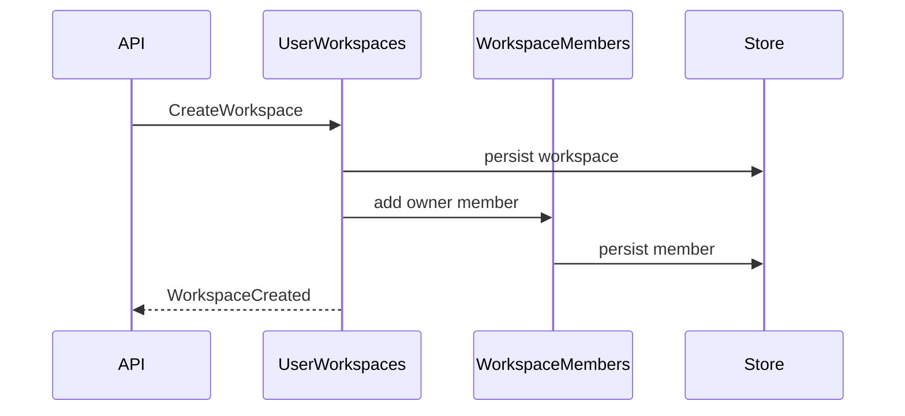
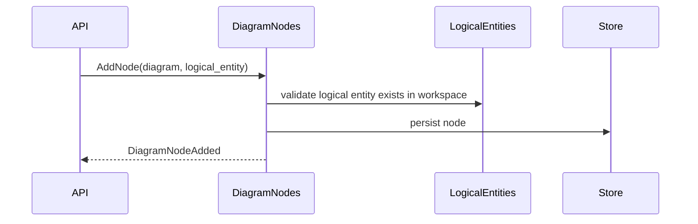

# 领域事件

本文定义 Evidence 领域中值得记录、发布或用于后续扩展的领域事件。当前项目未必已经实现事件总线；本文件用于统一事件语言并指导后续架构设计。

## 事件设计原则

- 领域事件使用过去式命名，表示已经发生的业务事实。
- 事件应包含最小必要上下文，不直接暴露数据库实现细节。
- 事件可以先作为审计和测试概念存在，后续再接入消息队列或应用事件处理器。
- 事件边界应匹配聚合边界，避免由 API handler 拼装业务事实。

## Identity & Workspace 事件

| 事件                       | 触发时机           | 关键载荷                         | 消费者/用途                           |
| -------------------------- | ------------------ | -------------------------------- | ------------------------------------- |
| UserCreated                | 创建用户后         | user_id                          | 初始化用户资源、审计。                |
| WorkspaceCreated           | 创建工作区后       | workspace_id、owner_user_id      | 创建 owner 成员、审计、默认图初始化。 |
| WorkspaceRenamed           | 更新工作区描述后   | workspace_id、old_name、new_name | 审计、前端刷新。                      |
| WorkspaceDeleted           | 删除工作区后       | workspace_id                     | 清理相关图和逻辑实体、审计。          |
| MemberAddedToWorkspace     | 成员加入工作区后   | workspace_id、user_id、role      | 权限刷新、通知。                      |
| MemberRemovedFromWorkspace | 成员移除后         | workspace_id、user_id            | 权限刷新、通知。                      |
| DuplicateMemberRejected    | 尝试添加重复成员时 | workspace_id、user_id            | 质量监控、冲突分析。                  |

## Modeling Core 事件

| 事件                           | 触发时机                | 关键载荷                                                          | 消费者/用途                |
| ------------------------------ | ----------------------- | ----------------------------------------------------------------- | -------------------------- |
| LogicalEntityCreated           | 创建逻辑实体后          | workspace_id、logical_entity_id、type、sub_type                   | 图建模候选列表刷新、审计。 |
| LogicalEntityUpdated           | 更新逻辑实体后          | workspace_id、logical_entity_id、changed_fields                   | 图节点展示刷新、审计。     |
| LogicalEntityDeleted           | 删除逻辑实体后          | workspace_id、logical_entity_id                                   | 检查图节点引用、审计。     |
| LogicalEntityClassified        | 类型或子类型确认/变更后 | logical_entity_id、old_type、new_type、old_sub_type、new_sub_type | 模型质量检查。             |
| LogicalEntityDefinitionChanged | 定义变更后              | logical_entity_id、old_definition、new_definition                 | 评审追踪、统一语言更新。   |

## Diagramming 事件

| 事件                 | 触发时机         | 关键载荷                                                           | 消费者/用途            |
| -------------------- | ---------------- | ------------------------------------------------------------------ | ---------------------- |
| DiagramCreated       | 创建图后         | workspace_id、diagram_id                                           | 前端列表刷新、审计。   |
| DiagramUpdated       | 更新图描述后     | workspace_id、diagram_id、changed_fields                           | 前端刷新、审计。       |
| DiagramDeleted       | 删除图后         | workspace_id、diagram_id                                           | 清理节点/边、审计。    |
| DiagramNodeAdded     | 添加节点后       | diagram_id、node_id、logical_entity_id                             | 图渲染刷新。           |
| DiagramNodeMoved     | 节点位置变化后   | diagram_id、node_id、position                                      | 图布局保存、协同同步。 |
| DiagramNodeRemoved   | 删除节点后       | diagram_id、node_id                                                | 删除或校验相关边。     |
| DiagramEdgeAdded     | 添加边后         | diagram_id、edge_id、source_node_id、target_node_id、relation_type | 图渲染刷新、关系分析。 |
| DiagramEdgeUpdated   | 更新边后         | diagram_id、edge_id、changed_fields                                | 图渲染刷新、审计。     |
| DiagramEdgeRemoved   | 删除边后         | diagram_id、edge_id                                                | 图渲染刷新。           |
| DanglingEdgeRejected | 尝试创建悬空边时 | diagram_id、source_node_id、target_node_id                         | 质量监控、错误提示。   |

## Persistence & Contracts 事件

| 事件               | 触发时机                      | 关键载荷                                        | 消费者/用途         |
| ------------------ | ----------------------------- | ----------------------------------------------- | ------------------- |
| StoreInitialized   | schema 初始化和种子数据完成后 | store_type、seeded_user_id、seeded_workspace_id | 启动诊断、测试。    |
| ContractTestPassed | 契约测试通过后                | store_type、contract_name                       | CI 可观测性。       |
| ContractTestFailed | 契约测试失败后                | store_type、contract_name、reason               | CI 阻断、回归定位。 |

## Evidence Workflow 事件

| 事件                    | 触发时机          | 关键载荷                       | 消费者/用途           |
| ----------------------- | ----------------- | ------------------------------ | --------------------- |
| WorkflowPhaseStarted    | 阶段开始时        | phase、round                   | 状态展示。            |
| WorkflowPhaseCompleted  | 阶段完成时        | phase、artifacts               | 审计日志、生成 gate。 |
| WorkflowGateCreated     | 需要人工审核时    | gate_id、phase、artifact_paths | 人类审核。            |
| WorkflowGateAnswered    | 审核门被回答时    | gate_id、decision              | 阶段推进。            |
| WorkflowReviewCompleted | Review 阶段完成时 | round、result、issues          | 质量改进。            |

## 事件流示例

### 创建工作区

### 创建图节点并引用逻辑实体

## 后续实现建议

- 先在 domain/application 层以类型定义事件，不急于引入外部消息队列。
- 用事件补强审计和测试命名，而不是替代当前 REST API。
- 对跨聚合副作用优先使用应用服务编排，必要时再使用事件处理器。
- 对 `DuplicateMemberRejected`、`DanglingEdgeRejected` 等失败事件，可先作为日志/监控事件，不一定进入业务事件流。
