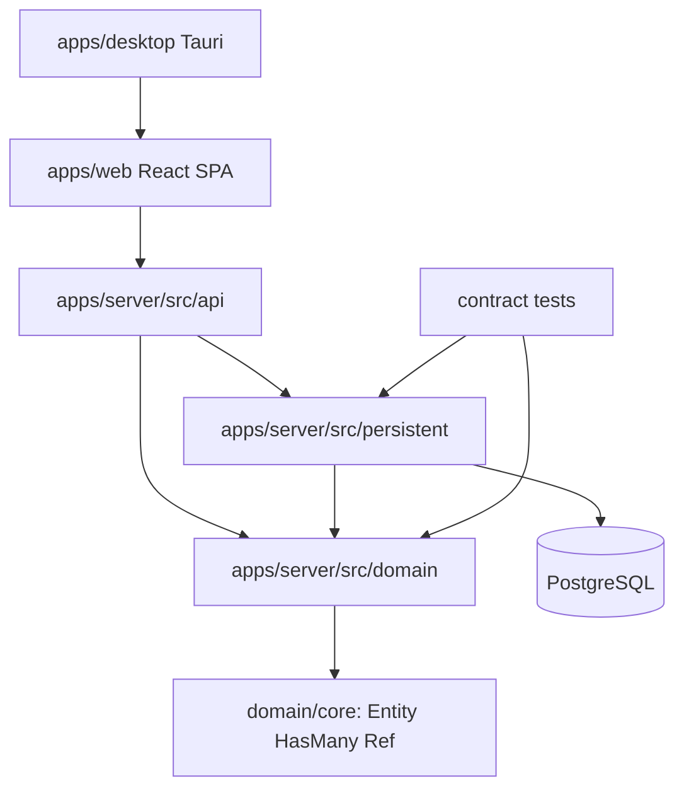

# 架构风格

Evidence 采用 **领域优先的模块化全栈架构**：前端为 React/Vite SPA，后端为 Rust Axum 服务，桌面端为 Tauri 2 壳，三者共享同一套领域语义和 REST/HAL API。

## 架构定位

| 维度     | 决策                                                         |
| -------- | ------------------------------------------------------------ |
| 系统形态 | Nx monorepo 中的 Web + Server + Desktop 多运行界面项目。     |
| 后端风格 | Rust Axum 模块化服务，API / Domain / Persistent 分层。       |
| 领域建模 | Domain traits first，使用 Entity、HasMany、Ref 等抽象。      |
| API 风格 | REST + HAL `_links` / `_embedded` / pagination。             |
| 前端风格 | 单一 React SPA，由 Web 和 Desktop 复用。                     |
| 桌面风格 | Tauri shell 包装同一 Web 前端。                              |
| 持久化   | SeaORM + PostgreSQL，fake store 作为契约测试替身。           |
| 工作流   | Evidence Workflow 通过 `.pi/` 和 `artifacts/` 记录产品增量。 |

## 分层架构

## 后端分层职责

| 层           | 路径                                         | 职责                                                          | 禁止事项                                    |
| ------------ | -------------------------------------------- | ------------------------------------------------------------- | ------------------------------------------- |
| API          | `apps/server/src/api/`                       | Axum routes、请求解析、HAL 响应、错误映射。                   | 不写核心业务规则，不直接拼接数据库逻辑。    |
| Domain       | `apps/server/src/domain/`                    | 领域 trait、聚合、实体和值对象。                              | 不依赖 Axum、SeaORM、PostgreSQL、前端类型。 |
| Persistent   | `apps/server/src/persistent/`                | SeaORM/PostgreSQL 实现、fake store、schema 初始化、契约测试。 | 不修改领域语言以迎合数据库细节。            |
| Entities     | `apps/server/src/persistent/entities/`       | SeaORM 表模型。                                               | 不作为 API DTO 或 domain entity 直接暴露。  |
| Test Support | `apps/server/src/persistent/test_support.rs` | fake store 与 contract tests。                                | 不只测 fake store 而忽略 PostgreSQL 契约。  |

## 前端/桌面架构

| 部分          | 路径                              | 决策                                                        |
| ------------- | --------------------------------- | ----------------------------------------------------------- |
| Web SPA       | `apps/web/`                       | 唯一前端源码，使用 React + Vite + react-router-dom。        |
| Desktop Shell | `apps/desktop/`                   | Tauri 2 壳，dev 时启动 Vite，build 时打包 `apps/web/dist`。 |
| API Client    | `libs/web/api-client/`            | 从 `contracts/api.yaml` 生成类型，降低 API 漂移。           |
| UI 库         | `libs/web/ui/` 或项目已有 UI 模块 | 组件复用，但不承载领域规则。                                |

## 关键架构原则

1. **领域 trait 优先**：新增领域能力先进入 `domain/`，再由 `persistent/` 实现。
2. **API handler 轻量化**：handler 只做协议转换、鉴权/校验入口、委托和序列化。
3. **前端唯一性**：`apps/web` 是 Web 与 Desktop 共享前端，不创建第二套桌面 UI。
4. **契约测试共享**：fake store 和 PostgreSQL 必须通过同一套 contract tests。
5. **HAL 一致性**：资源响应统一 `_links`，集合响应统一 `_embedded` 和 `page`。
6. **软删除一致性**：持久化查询必须过滤 `deleted_at`。
7. **工件可审计**：需求、模型、架构、计划和编码说明写入 `artifacts/`。

## 架构决策记录

### ADR-001：保持 Web/Desktop 共享前端

- **决策**：Desktop 不创建独立 React 应用，只通过 Tauri 加载或打包 `apps/web`。
- **原因**：避免业务语义分裂，降低维护成本。
- **影响**：桌面特有能力应通过 Tauri capability 或后端 API 扩展，而不是复制 UI。

### ADR-002：后端保持 Domain/Persistent 分离

- **决策**：Domain 定义 trait 和业务抽象，Persistent 实现 trait。
- **原因**：支持 fake store 和 PostgreSQL 共享契约测试。
- **影响**：新增表时不能绕过 domain trait 直接在 API handler 中访问 SeaORM。

### ADR-003：REST API 使用 HAL 风格

- **决策**：资源携带 `_links`，集合携带 `_embedded` 和 `page`。
- **原因**：提升 API 可导航性，契合当前 README 和实现约定。
- **影响**：新增资源必须补齐 self、collection 和相关 resource links。

### ADR-004：Evidence Workflow 作为项目审计流

- **决策**：使用 `.pi/extensions/evidence-workflow/`、`.pi/skills/`、`.pi/prompts/` 和 `artifacts/` 管理阶段工件。
- **原因**：将需求、DDD、架构、计划、编码、评审串联为可追溯流程。
- **影响**：workflow 工件不替代源码；编码阶段仍必须写真实代码和测试。

## 质量属性

| 质量属性     | 架构支撑                                                     |
| ------------ | ------------------------------------------------------------ |
| 可演进性     | Domain traits first、模块化上下文、Nx workspace。            |
| 可测试性     | fake store + PostgreSQL contract tests、Vitest、cargo test。 |
| 一致性       | HAL API、OpenAPI export、生成 API client。                   |
| 可维护性     | API/Domain/Persistent 分层，Web/Desktop 共享前端。           |
| 可审计性     | `artifacts/` 工件和 gates 记录阶段决策。                     |
| 本地开发体验 | `pnpm dev:web`、`pnpm dev:server`、`pnpm dev:desktop`。      |

## 演进建议

- 将图节点/边的复杂一致性规则继续下沉到 domain/persistent 层。
- 将 OpenAPI 导出和生成 client 纳入 CI 或 pre-merge 检查。
- 为前端补充以用户故事为中心的端到端或组件测试。
- 对 Nest/Prisma 相关实验入口明确定位，避免与 Rust Axum 主后端形成双主线。
