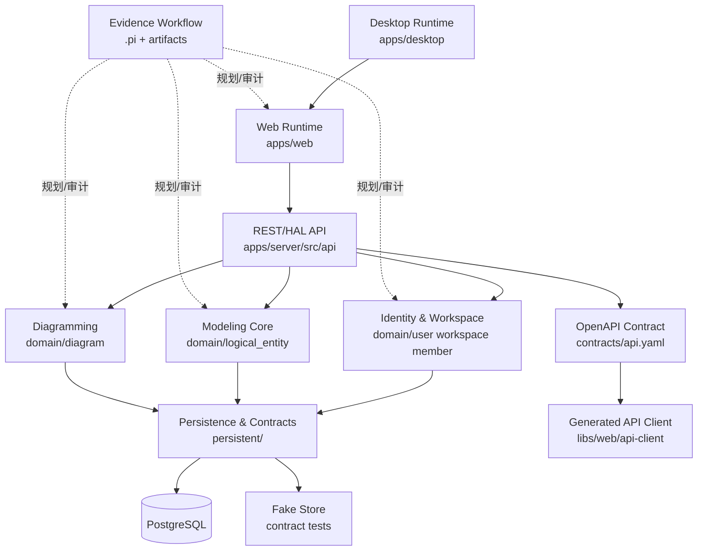

# 上下文映射

本文基于 `artifacts/02-domain-model/bounded-contexts.md`，将 Evidence 的限界上下文映射到当前代码结构、运行界面、API 集成和持久化边界。

## 上下文地图总览

## 上下文关系类型

| 上游上下文              | 下游上下文              | 关系类型                     | 集成方式                       | 说明                                              |
| ----------------------- | ----------------------- | ---------------------------- | ------------------------------ | ------------------------------------------------- |
| Web Runtime             | REST/HAL API            | Customer/Supplier            | HTTP JSON                      | Web 前端消费后端 API。                            |
| Desktop Runtime         | Web Runtime             | Shared Kernel / Wrapper      | Tauri WebView                  | Desktop 复用 `apps/web`，不拥有第二套领域语义。   |
| REST/HAL API            | Domain Contexts         | Published Language           | Rust trait/API DTO             | API 层解析请求，委托领域/持久化能力。             |
| Identity & Workspace    | Modeling Core           | Customer/Supplier            | Workspace ownership            | 逻辑实体必须归属于工作区。                        |
| Identity & Workspace    | Diagramming             | Customer/Supplier            | Workspace ownership            | 图必须归属于工作区。                              |
| Diagramming             | Modeling Core           | Conformist / Typed Reference | `Ref<LogicalEntity>`           | 图节点引用逻辑实体，遵守 Modeling Core 类型语言。 |
| Domain Contexts         | Persistence & Contracts | Ports & Adapters             | domain trait + persistent impl | 持久化实现领域 trait，不反向污染领域层。          |
| Persistence & Contracts | PostgreSQL              | Supplier                     | SeaORM                         | 生产持久化。                                      |
| Persistence & Contracts | Fake Store              | Test Double                  | contract tests                 | 单元/契约测试实现。                               |
| REST/HAL API            | OpenAPI Contract        | Published Language           | `contracts/api.yaml`           | 对外稳定 API 描述。                               |
| OpenAPI Contract        | Web API Client          | Generated Client             | `openapi-typescript`           | 前端类型和调用约束来源。                          |
| Evidence Workflow       | All Product Contexts    | Partnership                  | Markdown artifacts             | 用工件驱动需求、建模、架构、计划、编码与评审。    |

## 核心上下文说明

### Identity & Workspace

- **上游依赖**：REST/HAL API、Persistence & Contracts。
- **下游影响**：Modeling Core、Diagramming。
- **核心契约**：用户、工作区、成员关系和默认入口。
- **集成约束**：创建工作区必须创建 owner 成员；重复成员返回 Conflict。

### Modeling Core

- **上游依赖**：Identity & Workspace 提供工作区边界。
- **下游影响**：Diagramming 通过节点引用逻辑实体。
- **核心契约**：LogicalEntity 类型体系、子类型、定义、属性、行为、标签。
- **集成约束**：逻辑实体属于工作区，可独立于图存在。

### Diagramming

- **上游依赖**：Identity & Workspace、Modeling Core。
- **下游影响**：Web 图渲染和模型评审体验。
- **核心契约**：Diagram、DiagramNode、DiagramEdge。
- **集成约束**：边只能连接同一图内存在的节点；节点引用的逻辑实体需属于同一工作区。

### Runtime Surface

- **上游依赖**：API contract、Web build output。
- **下游影响**：用户体验和本地演示方式。
- **核心契约**：`apps/web` 是唯一前端源码；Desktop 只包装 Web。
- **集成约束**：Web/Desktop 不分裂业务语义。

### Persistence & Contracts

- **上游依赖**：Domain traits。
- **下游影响**：PostgreSQL schema、fake store、contract tests。
- **核心契约**：同一 domain contract 被 fake store 和 PostgreSQL 实现共享。
- **集成约束**：新增持久化实体必须同步 entity、schema、fake store、contract tests。

## 上下文防腐策略

| 外部/技术边界    | 防腐策略                                           | 实现位置                                 |
| ---------------- | -------------------------------------------------- | ---------------------------------------- |
| HTTP 请求/响应   | API DTO 与 HAL serializer，避免污染 domain。       | `apps/server/src/api/`                   |
| 数据库模型       | SeaORM entity 与 domain entity 分离。              | `apps/server/src/persistent/entities/`   |
| 前端运行模式     | Desktop 仅包装 Web，不复制前端业务。               | `apps/desktop/src-tauri/tauri.conf.json` |
| OpenAPI 生成类型 | 通过 `contracts/api.yaml` 与生成 client 管理边界。 | `contracts/`、`libs/web/api-client/`     |
| Workflow 工件    | `artifacts/` 只做审计和计划，不替代源码。          | `artifacts/`                             |

## 架构风险

| 风险                 | 影响                         | 缓解                                                   |
| -------------------- | ---------------------------- | ------------------------------------------------------ |
| API handler 变厚     | 业务规则分散，契约测试难覆盖 | 保持 handler 只解析、委托、序列化。                    |
| 图节点与逻辑实体混淆 | 模型语义不清                 | 统一语言中明确 Node 是呈现，LogicalEntity 是业务概念。 |
| Web/Desktop 分裂     | 双倍维护成本                 | Desktop 只复用 `apps/web` 构建产物。                   |
| 持久化 schema 先行   | Domain 受数据库结构牵引      | 先定义 domain trait，再实现 persistent。               |
| OpenAPI 与实现漂移   | 前端类型不可信               | 保持 `api:export` 与 `api:generate` 在交付流程中运行。 |
