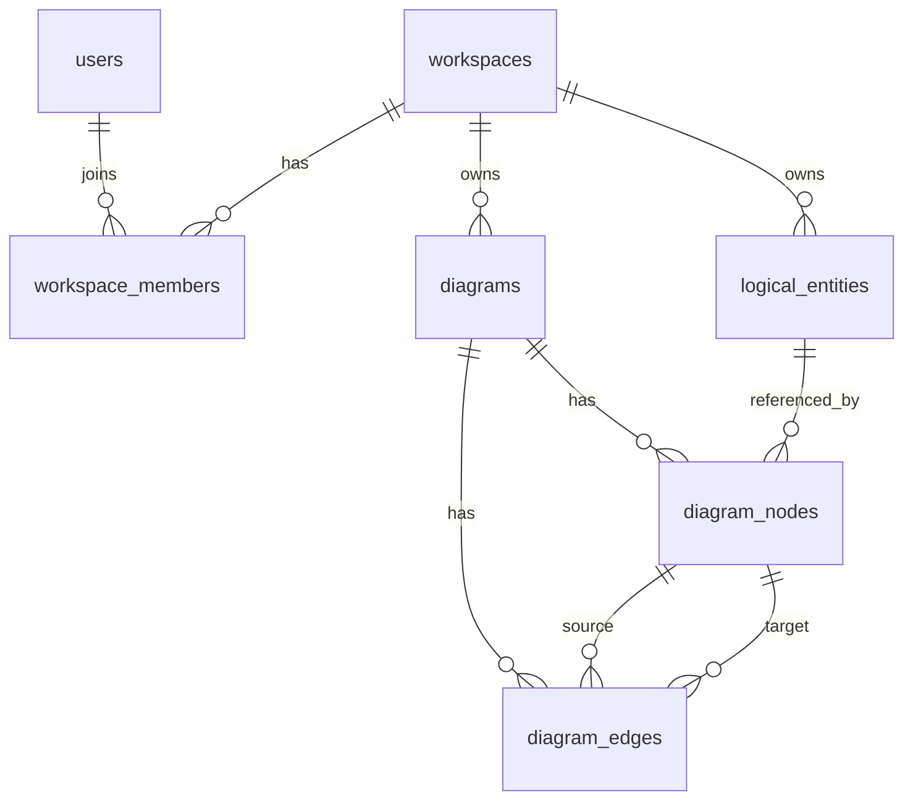

# 数据模型

本文记录 Evidence 的逻辑数据模型与持久化建议。实际实现应以 `apps/server/src/persistent/entities/` 和 `persistent/store.rs::init_schema()` 为准，本文件用于指导后续 schema、SeaORM entity、fake store 和 contract tests 的一致性。

## ER 图

## 表总览

| 表                  | 聚合/实体     | 说明                     |
| ------------------- | ------------- | ------------------------ |
| `users`             | User          | 用户资源。               |
| `workspaces`        | Workspace     | 建模工作区。             |
| `workspace_members` | Member        | 用户与工作区的成员关系。 |
| `logical_entities`  | LogicalEntity | 业务概念定义。           |
| `diagrams`          | Diagram       | 图容器。                 |
| `diagram_nodes`     | DiagramNode   | 图节点。                 |
| `diagram_edges`     | DiagramEdge   | 图边。                   |

## 通用字段约定

| 字段         | 类型建议                  | 说明                           |
| ------------ | ------------------------- | ------------------------------ |
| `id`         | text/uuid                 | 资源身份，需可用于 URL。       |
| `created_at` | text/timestamptz          | RFC 3339 时间戳。              |
| `updated_at` | text/timestamptz          | RFC 3339 时间戳。              |
| `deleted_at` | nullable text/timestamptz | soft delete 标记，查询时过滤。 |

## `users`

| 字段          | 类型建议  | 约束     | 说明                            |
| ------------- | --------- | -------- | ------------------------------- |
| `id`          | text      | PK       | 用户身份，例如 `desktop-user`。 |
| `name`        | text      | nullable | 展示名。                        |
| `description` | json/text | nullable | 用户描述。                      |
| `created_at`  | text      | not null | RFC 3339。                      |
| `updated_at`  | text      | not null | RFC 3339。                      |
| `deleted_at`  | text      | nullable | soft delete。                   |

索引：

- `pk_users_id`
- 查询默认用户时依赖 `id`。

## `workspaces`

| 字段          | 类型建议  | 约束     | 说明          |
| ------------- | --------- | -------- | ------------- |
| `id`          | text      | PK       | 工作区身份。  |
| `name`        | text      | not null | 工作区名称。  |
| `description` | text/json | nullable | 工作区说明。  |
| `created_at`  | text      | not null | RFC 3339。    |
| `updated_at`  | text      | not null | RFC 3339。    |
| `deleted_at`  | text      | nullable | soft delete。 |

索引：

- `pk_workspaces_id`
- `idx_workspaces_deleted_at`

## `workspace_members`

| 字段           | 类型建议 | 约束                | 说明                  |
| -------------- | -------- | ------------------- | --------------------- |
| `id`           | text     | PK                  | 成员关系身份。        |
| `workspace_id` | text     | FK -> workspaces.id | 所属工作区。          |
| `user_id`      | text     | FK -> users.id      | 成员用户。            |
| `role`         | text     | not null            | `owner` 或 `member`。 |
| `created_at`   | text     | not null            | RFC 3339。            |
| `updated_at`   | text     | not null            | RFC 3339。            |
| `deleted_at`   | text     | nullable            | soft delete。         |

索引和约束：

- `idx_workspace_members_workspace_id`
- `idx_workspace_members_user_id`
- `uq_workspace_members_workspace_user_active`：同一工作区 active 成员不能重复。

## `logical_entities`

| 字段           | 类型建议  | 约束                        | 说明                                           |
| -------------- | --------- | --------------------------- | ---------------------------------------------- |
| `id`           | text      | PK                          | 逻辑实体身份。                                 |
| `workspace_id` | text      | FK -> workspaces.id         | 所属工作区。                                   |
| `entity_type`  | text      | not null                    | `EVIDENCE`、`PARTICIPANT`、`ROLE`、`CONTEXT`。 |
| `sub_type`     | text      | not null                    | 与 type 兼容的子类型。                         |
| `definition`   | text      | nullable/not null by policy | 人类可读定义。                                 |
| `attributes`   | json/text | nullable                    | 属性数组。                                     |
| `behaviors`    | json/text | nullable                    | 行为数组。                                     |
| `tags`         | json/text | nullable                    | 标签数组。                                     |
| `created_at`   | text      | not null                    | RFC 3339。                                     |
| `updated_at`   | text      | not null                    | RFC 3339。                                     |
| `deleted_at`   | text      | nullable                    | soft delete。                                  |

索引和约束：

- `idx_logical_entities_workspace_id`
- `idx_logical_entities_type_sub_type`
- `idx_logical_entities_deleted_at`
- 应在 domain 层校验 `entity_type` 与 `sub_type` 兼容。

## `diagrams`

| 字段           | 类型建议  | 约束                | 说明          |
| -------------- | --------- | ------------------- | ------------- |
| `id`           | text      | PK                  | 图身份。      |
| `workspace_id` | text      | FK -> workspaces.id | 所属工作区。  |
| `name`         | text      | not null            | 图名称。      |
| `description`  | text/json | nullable            | 图说明。      |
| `created_at`   | text      | not null            | RFC 3339。    |
| `updated_at`   | text      | not null            | RFC 3339。    |
| `deleted_at`   | text      | nullable            | soft delete。 |

索引：

- `idx_diagrams_workspace_id`
- `idx_diagrams_deleted_at`

## `diagram_nodes`

| 字段                | 类型建议  | 约束                               | 说明           |
| ------------------- | --------- | ---------------------------------- | -------------- |
| `id`                | text      | PK                                 | 节点身份。     |
| `diagram_id`        | text      | FK -> diagrams.id                  | 所属图。       |
| `logical_entity_id` | text      | nullable FK -> logical_entities.id | 引用逻辑实体。 |
| `node_type`         | text      | not null                           | 节点类型。     |
| `position_x`        | number    | not null/default                   | x 坐标。       |
| `position_y`        | number    | not null/default                   | y 坐标。       |
| `style`             | json/text | nullable                           | 呈现样式。     |
| `created_at`        | text      | not null                           | RFC 3339。     |
| `updated_at`        | text      | not null                           | RFC 3339。     |
| `deleted_at`        | text      | nullable                           | soft delete。  |

索引和约束：

- `idx_diagram_nodes_diagram_id`
- `idx_diagram_nodes_logical_entity_id`
- 创建节点时校验 logical entity 与 diagram 属于同一 workspace。

## `diagram_edges`

| 字段             | 类型建议 | 约束                   | 说明          |
| ---------------- | -------- | ---------------------- | ------------- |
| `id`             | text     | PK                     | 边身份。      |
| `diagram_id`     | text     | FK -> diagrams.id      | 所属图。      |
| `source_node_id` | text     | FK -> diagram_nodes.id | 起点节点。    |
| `target_node_id` | text     | FK -> diagram_nodes.id | 终点节点。    |
| `relation_type`  | text     | not null               | 关系类型。    |
| `label`          | text     | nullable               | 展示标签。    |
| `created_at`     | text     | not null               | RFC 3339。    |
| `updated_at`     | text     | not null               | RFC 3339。    |
| `deleted_at`     | text     | nullable               | soft delete。 |

索引和约束：

- `idx_diagram_edges_diagram_id`
- `idx_diagram_edges_source_node_id`
- `idx_diagram_edges_target_node_id`
- source/target 节点必须属于同一 diagram。

## 种子数据

| 数据       | 值                      | 说明                       |
| ---------- | ----------------------- | -------------------------- |
| 默认用户   | `desktop-user`          | 本地/桌面快速入口。        |
| 默认工作区 | `default-workspace`     | 默认建模空间。             |
| 默认成员   | `desktop-user` as owner | 创建默认工作区时同步创建。 |

## 删除策略

- 所有核心资源优先使用 soft delete。
- 查询默认过滤 `deleted_at is null`。
- 删除工作区时，需要明确是否级联 soft delete members、diagrams、logical_entities。
- 删除节点时，应删除或阻止相关 edges，避免悬空边。
- 删除 logical entity 时，需决定保留引用失效节点还是阻止删除；建议在实现阶段补 contract tests 固化。

## 数据一致性测试建议

| 合约                 | fake store  | PostgreSQL  | 验收                                        |
| -------------------- | ----------- | ----------- | ------------------------------------------- |
| 用户看到种子工作区   | required    | required    | `desktop-user` 可找到 `default-workspace`。 |
| 创建工作区添加 owner | required    | required    | workspace 创建后有 owner member。           |
| 重复成员冲突         | required    | required    | 重复添加返回 Conflict。                     |
| 逻辑实体 CRUD        | required    | required    | 创建、读取、更新、删除语义一致。            |
| 图节点引用校验       | recommended | recommended | 无效 logical entity 返回错误。              |
| 图边悬空校验         | recommended | recommended | 无效 source/target 返回错误。               |
