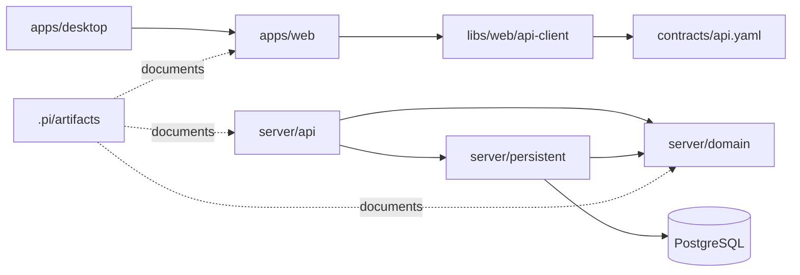

# 模块结构

本文定义 Evidence 当前仓库的模块结构和新增功能放置规则。它不是从上游 POC 复制的 Java/六边形模板，而是针对当前 React + Rust Axum + Tauri + Nx 架构定制。

## 仓库结构

```text
.
├── apps/
│   ├── web/                         # React + Vite SPA，唯一前端源码
│   ├── server/                      # Rust Axum 主后端
│   │   └── src/
│   │       ├── api/                 # REST routes、HAL serializers、request parsing
│   │       ├── domain/              # 纯领域 trait、聚合、实体和值对象
│   │       │   └── core/            # Entity、HasMany、Ref 等核心抽象
│   │       └── persistent/          # SeaORM/PostgreSQL + fake store 实现
│   │           ├── entities/        # SeaORM entity definitions
│   │           ├── store.rs         # schema 初始化、store wiring、seed data
│   │           └── test_support.rs  # fake store 与 contract tests
│   └── desktop/                     # Tauri 2 桌面壳
│       └── src-tauri/               # Tauri Rust crate、config、capabilities
├── contracts/
│   └── api.yaml                     # OpenAPI contract snapshot
├── libs/
│   └── web/
│       └── api-client/              # openapi-typescript 生成类型/客户端
├── artifacts/                       # Evidence Workflow 审计工件
│   ├── 00-user-input/
│   ├── 01-requirements/
│   ├── 02-domain-model/
│   ├── 03-architecture/
│   ├── 04-planning/
│   ├── 05-code/
│   ├── 06-reviews/
│   └── gates/
├── .pi/
│   ├── extensions/evidence-workflow/ # workflow state machine、tools、commands
│   ├── prompts/                      # workflow prompt templates
│   └── skills/                       # methodology skills
├── evidence-state.json               # workflow state
├── Cargo.toml                        # Rust workspace
├── nx.json                           # Nx workspace config
├── package.json                      # scripts、dependencies、pi resources
└── pnpm-workspace.yaml               # pnpm workspace
```

## 后端模块结构

### `apps/server/src/api/`

职责：

- 注册 Axum routes。
- 解析 path/query/body。
- 调用 domain/persistent 提供的能力。
- 将结果序列化为 HAL resource/collection。
- 将 `domain::ServerError` 映射为 HTTP 响应。

新增 API 建议：

```text
api/
├── mod.rs                 # route registration
├── users.rs               # users and user workspaces
├── workspaces.rs          # workspace resource and members if split
├── diagrams.rs            # diagrams, nodes, edges routes
├── logical_entities.rs    # logical entity routes
└── serialization/         # 可选：资源响应构造辅助
```

规则：

- handler 不直接实现业务不变量。
- 长文件优先抽取 serializer/helper，而不是混入 domain 逻辑。
- 所有集合接口保持 pagination 语义。

### `apps/server/src/domain/`

职责：

- 定义领域聚合和 trait。
- 保持框架无关。
- 表达 `Entity`、`HasMany`、`Ref` 模式。

当前/建议结构：

```text
domain/
├── core/
│   ├── entity.rs           # Entity trait
│   ├── has_many.rs         # HasMany trait
│   └── reference.rs        # Ref<T>
├── user.rs                 # User + UserWorkspaces
├── workspace.rs            # Workspace + WorkspaceMembers/Diagrams/LogicalEntities
├── member.rs               # Member and role
├── logical_entity.rs       # LogicalEntity type system
├── diagram/
│   ├── mod.rs              # Diagram aggregate
│   ├── node.rs             # DiagramNode
│   └── edge.rs             # DiagramEdge
└── mod.rs                  # domain exports and ServerError
```

规则：

- 新领域能力先在 domain 中建模。
- domain 不引用 Axum、SeaORM、PostgreSQL、React、Tauri。
- 领域错误使用 `ServerError::{NotFound, Validation, Conflict, Internal}`。

### `apps/server/src/persistent/`

职责：

- 实现 domain traits。
- 提供 PostgreSQL 和 fake store 两套实现。
- 初始化 schema 和 seed data。
- 承载 contract tests。

当前/建议结构：

```text
persistent/
├── entities/               # SeaORM entities
├── users.rs                # PgUsers implementation
├── workspaces.rs           # Workspace persistence if split
├── diagrams.rs             # Diagram persistence if split
├── logical_entities.rs     # LogicalEntity persistence if split
├── store.rs                # schema + store wiring
└── test_support.rs         # FakeUsers + contract tests
```

新增持久化实体步骤：

1. 在 `domain/` 定义 trait 和实体语言。
2. 在 `persistent/entities/` 创建 SeaORM entity。
3. 在 `persistent/` 实现 domain trait。
4. 在 `persistent/test_support.rs::contracts` 添加契约测试。
5. 在 `persistent/store.rs::init_schema()` 注册表和索引。
6. 在 fake store 和 PostgreSQL store 中保持同一语义。

## 前端模块结构

建议按领域视图组织，而不是按技术杂项堆叠：

```text
apps/web/src/
├── main.tsx
├── app/                         # app shell、routing、providers
├── routes/                      # route-level pages
│   ├── workspace-list/
│   ├── workspace-detail/
│   ├── diagram-detail/
│   └── logical-entity-detail/
├── features/
│   ├── workspaces/              # workspace UI/use-cases
│   ├── logical-entities/        # logical entity forms/lists
│   └── diagrams/                # diagram canvas, nodes, edges
├── shared/
│   ├── api/                     # generated client wrappers
│   ├── ui/                      # shared components
│   └── errors/                  # API error presentation
└── tests/ or colocated *.test.tsx
```

规则：

- API schema 类型来自 `libs/web/api-client`，不要手写漂移类型。
- Diagram 复杂交互应拆分 canvas、node、edge、inspector、toolbar。
- 领域命名与统一语言一致。
- 不在 Desktop 下复制 React 页面。

## Desktop 模块结构

```text
apps/desktop/
├── project.json
└── src-tauri/
    ├── tauri.conf.json          # dev/build/frontendDist source of truth
    ├── capabilities/
    │   └── default.json
    └── src/
```

规则：

- Desktop dev 使用 `http://127.0.0.1:4200`。
- Desktop build 运行 Web build 并打包 `apps/web/dist`。
- 桌面特有能力通过 Tauri command/capability 暴露，不复制 Web 业务。

## Workflow 模块结构

```text
.pi/
├── extensions/evidence-workflow/
│   ├── index.ts
│   ├── commands.ts
│   ├── tools.ts
│   ├── phases.ts
│   ├── state.ts
│   ├── gates.ts
│   ├── artifacts.ts
│   ├── prompts.ts
│   ├── status.ts
│   └── types.ts
├── prompts/
└── skills/
```

规则：

- Workflow 只负责编排和审计，不承载 Evidence 运行时业务逻辑。
- 阶段输出写入 `artifacts/`。
- 编码阶段必须写真实 `apps/`、`libs/` 或测试文件。

## 模块依赖规则



禁止依赖：

- `domain/` → `api/` 或 `persistent/`
- `domain/` → SeaORM/Axum/Tauri/React
- `apps/desktop` → 独立业务页面
- API handler → 直接数据库业务规则
- Workflow artifacts → 被运行时代码硬依赖
