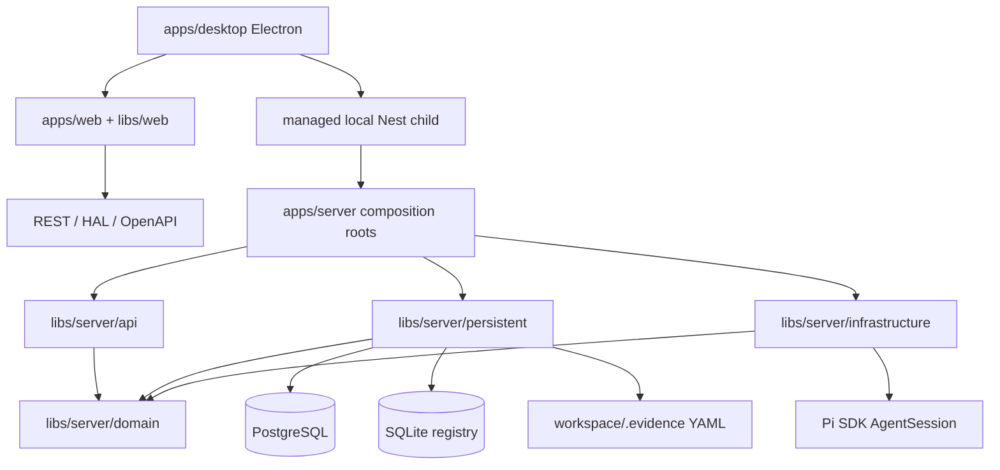

# Evidence 架构风格

本文件是跨迭代统一维护的技术方案。Feature iteration 只记录架构决策和增量，不复制本文件。

## 总体风格

Evidence 是一个 Nx/pnpm 管理的模块化 TypeScript monorepo：

- `apps/web`：React/Vite 组合根，功能实现位于 `libs/web/*`。
- `apps/server`：唯一 NestJS Server 组合根，API、Domain、Persistent、Infrastructure 位于 `libs/server/*`。
- `apps/desktop`：Electron main/preload 壳，复用 Web renderer，并管理本地 Nest 子进程。

Hosted Server 默认使用 PostgreSQL；Desktop 通过相同 domain/API 使用 SQLite registry 和本地 `.evidence` YAML。项目本地 Evidence Orchestrator 只辅助研发，不属于产品运行时或产品依赖图。

## 核心原则

1. **领域优先**：业务规则进入 domain；controller 只负责协议转换和委托。
2. **端口与适配器**：持久化和 Pi SDK 实现 domain ports，数据库或外部 SDK 不反向定义领域语言。
3. **单一服务端语义**：Nest 是唯一 Server runtime；Hosted 与 Desktop 只在 composition root 切换 adapter。
4. **单一前端**：Web 与 Desktop 共享 `apps/web` 和 `libs/web/*`，业务 API 不经 Electron IPC 复制。
5. **契约优先**：Nest 拥有 OpenAPI source，发布副本、Web client 和 black-box contract runner 必须同步。
6. **本地安全**：Electron 本地 Server 只监听随机 loopback 端口，并由 main 持有的随机 token 保护。
7. **可测试性驱动**：架构边界映射到 Q1/Q2、明确测试替身和可执行 Nx project gates。
8. **统一知识 + 迭代证据**：稳定知识统一维护；iteration 只保存输入、增量、决策和执行证据。

## 依赖方向

禁止反向依赖：

- Domain → Nest、HTTP、Prisma、SQLite、Electron 或 React。
- Web feature → Server 内部类型、Prisma schema 或数据库 adapter。
- Electron main/preload → 第二套业务 API 或 React 页面。
- Runtime code → `.pi/`、`engineering/evidence-orchestrator/` 或 `artifacts/iterations/`。

## 运行时组合

- `AppModule`：Hosted 入口，默认注入 Prisma/PostgreSQL registry。
- `DesktopAppModule`：Electron child 入口，注入 `node:sqlite` registry。
- 两个入口共享 `ApiModule`、Domain、filesystem model store 和 Pi adapter。
- Workspace metadata 保存 `repositoryRoot`/`evidenceRoot`；模型实体和关联写入 `.evidence`，Diagram 为其单一投影。
- Electron remote mode 只替换 API endpoint，不改变 renderer 或产品语义。

## 架构变更规则

- 场景若符合现有架构，iteration 的 `architecture-decisions.md` 明确记录“无新架构决策”。
- 新决策先以 iteration ADR 评审；只有跨 Feature 稳定适用时才提升到本目录。
- 运行时事实优先由源码、OpenAPI、Prisma migration、SQLite schema、electron-builder 配置和测试表达；Markdown 不得成为冲突的重复真相源。
- 迁移兼容代码可以读取已退役格式，但不得恢复第二条 Server/Desktop 实现轨道。
