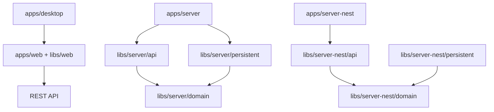

# Evidence 架构风格

本文件是跨迭代统一维护的技术方案。Feature iteration 只记录架构决策和增量，不复制本文件。

## 总体风格

Evidence 是 Nx/pnpm 与 Cargo 组成的模块化全栈 monorepo：

- `apps/web`：React/Vite 组合根，功能实现位于 `libs/web/*`。
- `apps/server`：Rust Axum 组合根，API、Domain、Persistent、Infrastructure 位于 `libs/server/*`。
- `apps/server-nest`：TypeScript/Nest 组合根，模块位于 `libs/server-nest/*`。
- `apps/desktop`：Tauri 2 壳，复用 Web 前端。

Rust 与 Nest 是两个服务端实现轨道。一个 Feature 必须明确 owning runtime，不得在同一服务端能力中混合两套模块。项目本地 Evidence Orchestrator 只辅助这些模块的研发，不属于产品运行时或依赖图。

## 核心原则

1. **领域优先**：业务规则进入 domain；API handler/controller 只负责协议转换和委托。
2. **端口与适配器**：持久化实现领域接口，数据库结构不反向定义领域语言。
3. **单一前端**：Web 与 Desktop 共享 `apps/web` 和 `libs/web/*`。
4. **契约优先**：REST/OpenAPI 语义由 `contracts/api.yaml` 和实现共同验证。
5. **可测试性驱动**：架构边界必须能映射到 Q1/Q2 测试和明确测试替身。
6. **统一知识 + 迭代证据**：稳定产品、模型、架构和工序统一维护；iteration 只保存输入、增量、决策和执行证据。

## 依赖方向

## 架构变更规则

- 场景若符合现有架构，iteration 的 `architecture-decisions.md` 明确记录“无新架构决策”。
- 新决策先以 iteration ADR 形式评审；只有跨 Feature 稳定适用时才提升到本目录。
- 运行时契约事实优先由源码、OpenAPI、migration 和测试表达，Markdown 不得成为重复真相源。
