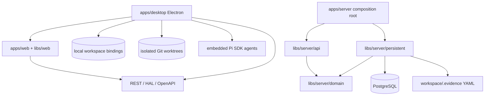

# Evidence 架构风格

本文件是跨迭代统一维护的技术方案。Feature iteration 只记录架构决策和增量，不复制本文件。

## 总体风格

Evidence 是一个 Nx/pnpm 管理的模块化 TypeScript monorepo：

- `apps/web`：React/Vite 组合根，功能实现位于 `libs/web/*`。
- `apps/server`：唯一 NestJS Server 组合根，API、Domain、Persistent 位于 `libs/server/*`。
- `apps/desktop`：Electron main/preload 壳，复用 Web renderer，并连接经过健康检查的 Server API。

Server 只使用 PostgreSQL 与工作空间 `.evidence` YAML；Desktop 不包含第二个 Server 或数据库。项目本地 Evidence Orchestrator 只辅助研发，不属于产品运行时或产品依赖图。

## 核心原则

1. **领域优先**：业务规则进入 domain；controller 只负责协议转换和委托。
2. **端口与适配器**：持久化实现 domain ports，数据库或外部 SDK 不反向定义领域语言。
3. **单一服务端运行时**：Nest/PostgreSQL 是唯一 Server runtime；Desktop 是 API client 与受限本地执行边界，不包含第二个 Server。
4. **单一前端**：Web 与 Desktop 共享 `apps/web` 和 `libs/web/*`，业务 API 不经 Electron IPC 复制。
5. **契约优先**：Nest 拥有 OpenAPI source，发布副本、Web client 和 black-box contract runner 必须同步。
6. **Desktop 安全**：Electron 只连接经过健康检查的 API；非 loopback endpoint 必须使用 HTTPS，Authorization 只由 main 注入目标 API。
7. **Hosted 安全**：Server 默认只监听 loopback；远程监听必须认证部署 principal，Workspace 查询必须经过 membership。
8. **可测试性驱动**：架构边界映射到 Q1/Q2、明确测试替身和可执行 Nx project gates。
9. **统一知识 + 迭代证据**：稳定知识统一维护；iteration 只保存输入、增量、决策和执行证据。

## 依赖方向

禁止反向依赖：

- Domain → Nest、HTTP、Prisma、Electron 或 React。
- Web feature → Server 内部类型、Prisma schema 或数据库 adapter。
- Electron main/preload → 第二套业务 API 或 React 页面。
- Runtime code → `.pi/`、`engineering/evidence-orchestrator/` 或 `artifacts/iterations/`。

## 运行时组合

- `AppModule`：唯一 Server 入口，注入 Prisma/PostgreSQL registry。
- `ApiModule`、Domain 与 filesystem model store 只由该 Server 组合根装配；Server 不加载 Pi SDK。
- PostgreSQL Workspace row 以私有 `modelRoot` 定位 Server 自有 `.evidence`；公开 metadata 不包含绝对路径，Diagram 为模型的单一投影。
- Electron 通过 `EVIDENCE_API_BASE_URL` 选择 API endpoint，在 main process 以 API + Workspace 保存本地 repository binding，并为 CodingRun 创建隔离 branch/worktree、运行受限 Pi 工具与固定质量门。
- `EVIDENCE_API_AUTHORIZATION` 只向配置 API 的请求注入，不通过 preload 暴露；Server 的非 loopback 监听缺少该配置时拒绝启动。

## 架构变更规则

- 场景若符合现有架构，iteration 的 `architecture-decisions.md` 明确记录“无新架构决策”。
- 新决策先以 iteration ADR 评审；只有跨 Feature 稳定适用时才提升到本目录。
- 运行时事实优先由源码、OpenAPI、Prisma migration、electron-builder 配置和测试表达；Markdown 不得成为冲突的重复真相源。
