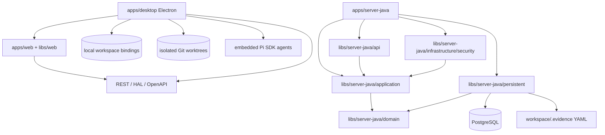

# Evidence 架构风格

本文件是跨迭代统一维护的技术方案。Feature iteration 只记录增量决策，不复制本文件。

## 总体风格

Evidence 是由 Nx 统一编排的 Java/TypeScript monorepo：

- `apps/web`：React/Vite 组合根，功能实现位于 `libs/web/*`。
- `apps/server-java`：唯一 Spring Boot/Jersey Server 组合根，服务端实现位于 `libs/server-java/*`。
- `apps/desktop`：Electron main/preload 壳，复用 Web renderer，并连接经过健康检查的 Server API。

Server 只使用 PostgreSQL registry 与工作空间 `.evidence` YAML；Desktop 不包含第二个 Server 或数据库。

## 核心原则

1. **领域优先**：业务规则进入 domain；JAX-RS resource 只负责协议转换和委托。
2. **端口与适配器**：persistence/security 实现内层 ports，框架不得反向定义领域语言。
3. **单一服务端运行时**：Java/PostgreSQL 是唯一 Server runtime。
4. **单一前端**：Web 与 Desktop 共享 `apps/web` 和 `libs/web/*`，业务 API 不经 Electron IPC 复制。
5. **契约优先**：语言无关的 OpenAPI、Web client 和 black-box contracts 必须同步。
6. **Desktop 安全**：Electron 只连接经过健康检查的 API；Authorization 只由 main 注入目标 API。
7. **Hosted 安全**：远程部署通过 OIDC JWT 建立 principal，Workspace 访问必须经过 membership 与 role 授权。
8. **可测试性驱动**：架构边界映射到 Q1/Q2、明确测试替身和可执行 Nx/Gradle gates。

## 依赖方向

禁止反向依赖：

- Domain → Spring、JAX-RS、MyBatis、Jackson、Electron 或 React。
- Web feature → Server 内部类型、SQL migration 或 persistence adapter。
- Electron main/preload → 第二套业务 API 或 React 页面。

## 运行时组合

- `Application` 是唯一 Server 入口，装配 JAX-RS、application services、MyBatis/Flyway、filesystem 与 security adapters。
- PostgreSQL Workspace row 以私有 `modelRoot` 定位 Server 自有 `.evidence`；HAL metadata 不包含绝对路径。
- Electron 通过 `EVIDENCE_API_BASE_URL` 选择 API endpoint，以 API + Workspace 保存本地 repository binding，并按 Server `nextAction` 运行受限本地角色。
- `local` 模式的静态 Authorization 不通过 preload 暴露；Hosted Browser 使用 OIDC Authorization Code + PKCE。

## 架构变更规则

- 新决策先在 iteration 中评审，跨 Feature 稳定后再提升到本目录。
- 运行时事实优先由源码、`libs/contracts/evidence.openapi`、Flyway SQL、electron-builder 配置和测试表达。
- 数据库变更只能追加受版本控制的 Flyway migration，不使用 Hibernate 自动建表。
